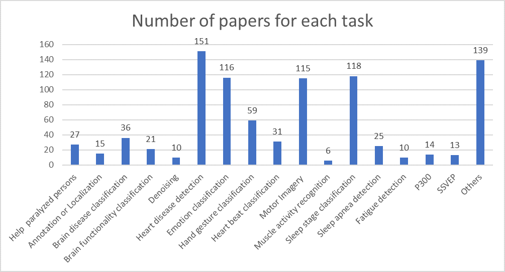
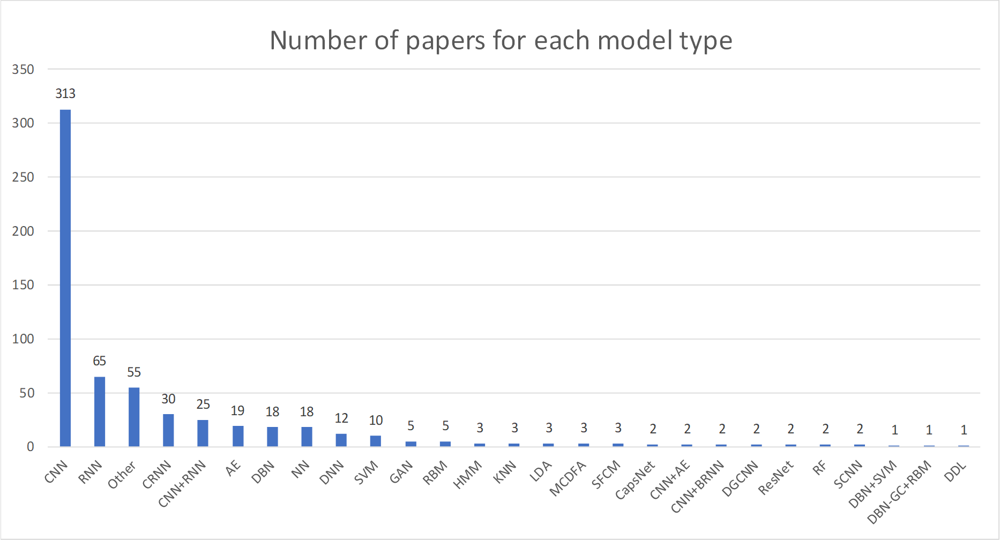
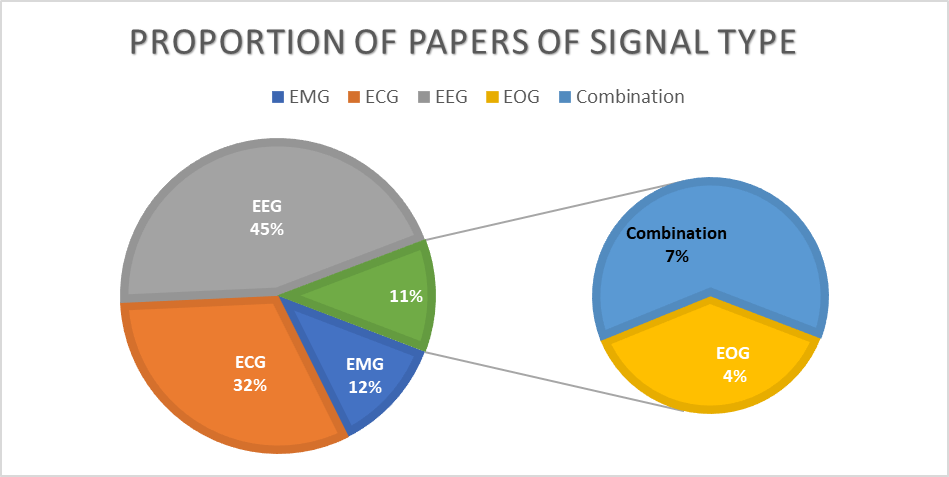

# Physiological Signal Classification Papers

**This repo contains a list of papers for physiological signal classification using machine learning/deep learning.**

If you have any suggested papers, please contact me ziyujia{at}bjtu.edu.cn

## Contents

- [Physiological Signal Classification Papers](#physiological-signal-classification-papers)
  - [Contents](#contents)
  - [Overall Statistics](#overall-statistics)
  - [Paper lists categorized by signal type](#paper-lists-categorized-by-signal-type)
    - [EEG](#eeg)
    - [ECG](#ecg)
    - [EMG](#emg)
    - [EOG](#eog)
    - [Combination of signals](#combination-of-signals)
  - [Acknowledgement](#acknowledgement)
  - [More paper lists](#more-paper-lists)

## Overall Statistics

We conduct the overall statistical analysis of all papers in this list. Here we give the number of papers for each task, the number of papers of each model type, and the proportion of papers of signal type.

## Paper lists categorized by signal type

### EEG

| Task/Application                                             | Title                                                        |         Model         |                        Publication                        | Year |
| ------------------------------------------------------------ | :----------------------------------------------------------- | :-------------------: | :-------------------------------------------------------: | :--: |
| Motor Imagery                                                | Motor Imagery EEG Spectral-Spatial Feature Optimization Using Dual-Tree Complex Wavelet and Neighbourhood Component Analysis |          ML           |                           IRBM                            | 2022 |
| Motor Imagery                                                | EEG-based motor imagery classification using convolutional neural networks with local reparameterization trick |          CNN          |                           ESWA                            | 2022 |
| Motor Imagery                                                | A framework for motor imagery with LSTM neural network       |         LSTM          |                           CMPB                            | 2022 |
| Motor Imagery                                                | Motor imagery based brain-computer interface: improving the EEG classification using Delta rhythm and LightGBM algorithm |          DT           |                           BSPC                            | 2022 |
| Motor Imagery                                                | Motor imagery EEG classification algorithm based on CNN-LSTM feature fusion network |       CNN&LSTM        |                           BSPC                            | 2022 |
| Motor Imagery                                                | A Multibranch of Convolutional Neural Network Models for Electroencephalogram-Based Motor Imagery Classification |          CNN          |                      MDPI Biosensors                      | 2022 |
| Motor Imagery                                                | A transfer learning-based CNN and LSTM hybrid deep learning model to classify motor imagery EEG signals |         LSTM          |             Computers in Biology and Medicine             | 2022 |
| Motor Imagery                                                | An efficient multi-scale CNN model with intrinsic feature integration for motor imagery EEG subject classification in brain-machine interfaces |          CNN          |                           BSPC                            | 2022 |
| Motor Imagery                                                | A classification method for EEG motor imagery signals based on parallel convolutional neural network |          CNN          |                           BSPC                            | 2022 |
| Motor Imagery                                                | Multiscale space-time-frequency feature-guided multitask learning CNN for motor imagery EEG classification |          CNN          |               Journal of Neural Engineering               | 2021 |
| Motor Imagery                                                | A Novel Ensemble Learning Approach for Classification of EEG Motor Imagery Signals |   Ensemble Learning   |                           IWCMC                           | 2021 |
| Motor Imagery                                                | Attention-Inception and Long-Short-Term Memory-Based Electroencephalography Classification for Motor Imagery Tasks in Rehabilitation |          CNN          |                         IEEE TII                          | 2021 |
| Motor Imagery                                                | Semi-Supervised Contrastive Learning for Generalizable Motor Imagery EEG Classification | Contrastive Learning  |                         IEEE BSN                          | 2021 |
| Motor Imagery                                                | Time window and frequency band optimization using regularized neighbourhood component analysis for Multi-View Motor Imagery EEG classification |          ML           |                           BSPC                            | 2021 |
| Motor Imagery                                                | A motor imagery EEG signal classification algorithm based on recurrence plot convolution neural network |          CNN          |                Pattern Recognition Letters                | 2021 |
| Motor Imagery                                                | MIN2Net: End-to-End Multi-Task Learning for Subject-Independent Motor Imagery EEG Classification |          CNN          |                         IEEE TBME                         | 2021 |
| Motor Imagery                                                | A novel motor imagery EEG decoding method based on feature separation |         FSNAL         |               Journal of Neural Engineering               | 2021 |
| Motor Imagery                                                | Automatic feature extraction and fusion recognition of motor imagery EEG using multilevel multiscale CNN |          CNN          |                           MBEC                            | 2021 |
| Motor Imagery                                                | A channel-mixing convolutional neural network for motor imagery EEG decoding and feature visualization |          CNN          |                           BSPC                            | 2021 |
| Motor Imagery                                                | MIDNN - a classification approach for the EEG based motor imagery tasks using deep neural network |          DNN          |                   Applied Intelligence                    | 2021 |
| Motor Imagery                                                | EEG-based motor imagery classification using digraph Fourier transforms and extreme learning machines |          ELM          |                           BSPC                            | 2021 |
| Motor Imagery                                                | Spatio-Spectral Feature Representation for Motor Imagery Classification Using Convolutional Neural Networks |          CNN          |                        IEEE TNNLS                         | 2021 |
| Motor Imagery                                                | Multilayer Network Approach in EEG Motor Imagery with an Adaptive Threshold |          MLP          |                       MDPI Sensors                        | 2021 |
| Motor Imagery                                                | Shallow Convolutional Network Excel for Classifying Motor Imagery EEG in BCI Applications |          CNN          |                        IEEE Access                        | 2021 |
| Motor Imagery                                                | An EEG channel selection method for motor imagery based brain–computer interface and neurofeedback using Granger causality |          ML           |                      Neural Networks                      | 2021 |
| Motor Imagery                                                | Boosting-LDA algriothm with multi-domain feature fusion for motor imagery EEG decoding |          LDA          |                           BSPC                            | 2021 |
| Motor Imagery                                                | NeuroGrasp: Real-Time EEG Classification of High-Level Motor Imagery Tasks Using a Dual-Stage Deep Learning Framework |          --           |                         IEEE TCYB                         | 2021 |
| Motor Imagery                                                | Advanced TSGL-EEGNet for Motor Imagery EEG-Based Brain-Computer Interfaces |          CNN          |                        IEEE Access                        | 2021 |
| Motor Imagery                                                | A Temporal-Spectral-Based Squeeze-and- Excitation Feature Fusion Network for Motor Imagery EEG Decoding |          CNN          |                        IEEE TNSRE                         | 2021 |
| Motor Imagery                                                | EEG feature fusion for motor imagery: A new robust framework towards stroke patients rehabilitation |          ML           |             Computers in Biology and Medicine             | 2021 |
| Motor Imagery                                                | Learning Common Time-Frequency-Spatial Patterns for Motor Imagery Classification |          SVM          |                        IEEE TNSRE                         | 2021 |
| Motor Imagery                                                | Attention based Inception model for robust EEG motor imagery classification |          CNN          |                        IEEE I2MTC                         | 2021 |
| Motor Imagery                                                | Electroencephalography-based motor imagery classification using temporal convolutional network fusion |          CNN          |                           BSPC                            | 2021 |
| Motor Imagery                                                | Adaptive transfer learning for EEG motor imagery classification with deep Convolutional Neural Network |          CNN          |                      Neural Networks                      | 2021 |
| Motor Imagery                                                | EEG-inception: an accurate and robust end-to-end neural network for EEG-based motor imagery classification |          CNN          |               Journal of Neural Engineering               | 2021 |
| Motor Imagery                                                | Motor Imagery EEG Decoding Method Based on a Discriminative Feature Learning Strategy |          CNN          |                        IEEE TNSRE                         | 2021 |
| Motor Imagery                                                | A Sliding Window Common Spatial Pattern for Enhancing Motor Imagery Classification in EEG-BCI |          LDA          |                         IEEE TIM                          | 2021 |
| Motor Imagery                                                | EEG motor imagery classification using dynamic connectivity patterns and convolutional autoencoder |          CNN          |                           BSPC                            | 2021 |
| Motor Imagery                                                | Hybrid deep neural network using transfer learning for EEG motor imagery decoding |          NN           |                           BSPC                            | 2021 |
| Motor  Imagery                                               | MMCNN:  A Multi-branch Multi-scale Convolutional Neural Network for Motor Imagery  Classification |          CNN          |                         ECML PKDD                         | 2021 |
| Motor  Imagery                                               | Motor  imagery EEG recognition based on conditional optimization empirical mode  decomposition and multi-scale convolutional neural network |          CNN          |                     Expert  Syst Appl                     | 2020 |
| Motor  Imagery                                               | Making  sense of spatio-temporal preserving representations for EEG-based human  intention recognition |       CNN, LSTM       |                   IEEE  Trans. Cybern.                    | 2020 |
| Motor  Imagery                                               | A  deep CNN approach to decode motor preparation of upper limbs from  time–frequency maps of EEG signals at source level |     CNN (CWT,TF)      |                     Neural  Networks                      | 2020 |
| Motor  Imagery                                               | Convolutional  neural network based features for motor imagery EEG signals classification in  brain–computer interface system |          SVM          |                     Applied  Sciences                     | 2020 |
| Motor  Imagery                                               | A  novel simplified convolutional neural network  classification algorithm of motor imagery EEG signals based on deep learning |      SCNN (CWT)       |                     Applied Sciences                      | 2020 |
| Motor  Imagery                                               | HS-CNN:  a CNN with hybrid convolution scale for EEG motor imagery classification |          CNN          |                     J.  Neural. Eng.                      | 2020 |
| Motor  Imagery                                               | Learning  Space-Time-Frequency Representation with Two-Stream Attention Based 3D  Network for Motor Imagery Classification |          CNN          |                        IEEE  ICDM                         | 2020 |
| Motor  Imagery                                               | Application  of continuous wavelet transform and convolutional neural network in decoding  motor imagery brain-computer interface |       CNN (CWT)       |                          Entropy                          | 2019 |
| Motor  Imagery                                               | Deep  Learning for EEG motor imagery classification based on multi-layer CNNs  feature fusion |          CNN          |                 Future  Gener Comput Syst                 | 2019 |
| Motor  Imagery                                               | A  novel end‐to‐end deep learning scheme for  classifying multi‐class  motor imagery electroencephalography signals. |          GDL          |                      Expert  Systems                      | 2019 |
| Motor  Imagery                                               | Deep  Channel-Correlation Network for Motor Imagery Decoding From the Same Limb |          CNN          |          IEEE  Trans. Neural Syst. Rehabil. Eng.          | 2019 |
| Motor  Imagery                                               | A  parallel multiscale filter bank convolutional neural networks for motor  imagery EEG classification. |          CNN          |                     Front.  Neurosci.                     | 2019 |
| Motor  Imagery                                               | Subject-independent  brain–computer interfaces based on deep convolutional neural networks. |      CNN (SSFR)       |          IEEE  Trans. Neural Netw. Learn. Syst.           | 2019 |
| Motor  Imagery                                               | A  new approach for motor imagery classification based on sorted blind source  separation, continuous wavelet transform, and convolutional neural network |       CNN (CWT)       |                          Sensors                          | 2019 |
| Motor  Imagery                                               | A  multi-branch 3D convolutional neural network for EEG-based motor imagery  classification. |          CNN          |          IEEE  Trans. Neural Syst. Rehabil. Eng.          | 2019 |
| Motor  Imagery                                               | A  novel hybrid deep learning scheme for four-class motor imagery  classification. |   CNN, LSTM (FBCSP)   |                       J  Neural Eng                       | 2019 |
| Motor  Imagery                                               | An  advanced bispectrum features for EEG-based motor imagery classification. |      SVM (VSBS)       |             Expert  Systems with Applications             | 2019 |
| Motor  Imagery                                               | Densely  feature fusion based on convolutional neural networks for motor imagery EEG  classification |      CNN (DFFN)       |                       IEEE  Access                        | 2019 |
| Motor  Imagery                                               | A  deep learning framework for decoding motor imagery tasks of the same hand  using EEG signals |      CNN (QTFD)       |                       IEEE  Access                        | 2019 |
| Motor  Imagery                                               | A  deep transfer convolutional neural network framework for EEG signal  classification. |          CNN          |                       IEEE  Access                        | 2019 |
| Motor  Imagery                                               | A  channel-projection mixed-scale convolutional neural network for motor imagery  EEG decoding |          CNN          |          IEEE  Trans. Neural Syst. Rehabil. Eng.          | 2019 |
| Motor  Imagery                                               | Learning  joint space–time–frequency features for EEG decoding on small labeled data. |          CNN          |                     Neural  Networks                      | 2019 |
| Motor  Imagery                                               | Motor  imagery EEG classification using capsule networks     |      CNN (STFT)       |                          Sensors                          | 2019 |
| Motor  Imagery                                               | Semisupervised  deep stacking network with adaptive learning rate strategy for motor imagery  EEG recognition. |         SADSN         |                    Neural  computation                    | 2019 |
| Motor  Imagery                                               | Efficient  classification of motor imagery electroencephalography signals using deep  learning methods. |          CNN          |                          Sensors                          | 2019 |
| Motor  Imagery                                               | Separated  channel convolutional neural network to realize the training free motor  imagery BCI systems |       SCNN(CSP)       |               Biomed Signal Process Control               | 2019 |
| Motor  Imagery                                               | A  convolutional recurrent attention model for subject-independent EEG signal  analysis. |    CNN, RNN (CRAM)    |                IEEE Signal Process. Lett.                 | 2019 |
| Motor  Imagery                                               | Classification  of multiple motor imagery using deep convolutional neural networks and  spatial filters |     CNN (DFBCSP)      |                     Appl  Soft Comput                     | 2019 |
| Motor  Imagery                                               | Convolutional  neural network based approach towards motor imagery tasks EEG signals  classification |    CNN (STFT,CWT)     |                     IEEE  Sensors J.                      | 2019 |
| Motor  Imagery                                               | Domain  adaptation with source selection for motor-imagery based BCI |       CNN (PSD)       |                            BCI                            | 2019 |
| Motor  Imagery                                               | Validating  deep neural networks for online decoding of motor imagery movements from EEG  signals. |       LSTM, CNN       |                          Sensors                          | 2019 |
| Motor  Imagery                                               | Multilevel  weighted feature fusion using convolutional neural networks for EEG motor  imagery classification |          CNN          |                       IEEE  Access                        | 2019 |
| Motor  Imagery                                               | A  novel deep learning approach with data augmentation to classify motor imagery  signals. |       CNN, WNN        |                       IEEE  Access                        | 2019 |
| Motor  Imagery                                               | EEG  classification of motor imagery using a novel deep learning framework |      CNN (STFT)       |                          Sensors                          | 2019 |
| Motor  Imagery                                               | Walking  imagery evaluation in brain computer interfaces via a multi-view multi-level  deep polynomial network. | MMDPN (CSP, PSD, WPT) |          IEEE  Trans. Neural Syst. Rehabil. Eng.          | 2019 |
| Motor  Imagery                                               | Multimodal  fuzzy fusion for enhancing the motor-imagery-based brain computer interface. |          MFF          |                   IEEE  Comput Intell M                   | 2019 |
| Motor Imagery                                                | Characterization of  Industry 4.0 Lean Management Problem-Solving Behavioral Patterns Using EEG  Sensors and Deep Learning |          CNN          |                          Sensors                          | 2019 |
| Motor Imagery                                                | Deep learning with EEG spectrograms in rapid  eye movement behavior disorder |          CNN          |                      Front. Neurol.                       | 2019 |
| Motor  Imagery                                               | Wavelet  transform time-frequency image and convolutional network-based motor imagery  EEG classification. |          CNN          |                       IEEE  Access                        | 2018 |
| Motor  Imagery                                               | An  end-to-end deep learning approach to MI-EEG signal classification for BCIs. |          CNN          |                     Expert  Syst Appl                     | 2018 |
| Motor  Imagery                                               | Deep  fusion feature learning network for MI-EEG classification. |    CNN, LSTM (DWT)    |                       IEEE  Access                        | 2018 |
| Motor  Imagery                                               | LSTM-based  EEG classification in motor imagery tasks.       |         LSTM          |          IEEE  Trans. Neural Syst. Rehabil. Eng.          | 2018 |
| Motor  Imagery                                               | EEG  classification using sparse Bayesian extreme learning machine for  brain–computer interface. |         SBELM         |                    Neural  Comput Appl                    | 2018 |
| Motor  Imagery                                               | Exploring  spatial-frequency-sequential relationships for motor imagery classification  with recurrent neural network. |   LSTM, GRU (FBCSP)   |                    BMC  bioinformatics                    | 2018 |
| Motor  Imagery                                               | A  hierarchical semi-supervised extreme learning machine method for EEG  recognition. |        HSS-ELM        |                 Med.  Biol. Eng. Comput.                  | 2018 |
| Motor  Imagery                                               | EEGNet:  a compact convolutional neural network for EEG-based brain–computer  interfaces. |          CNN          |                       J  Neural Eng                       | 2018 |
| Motor  Imagery                                               | The  motor imagination EEG recognition combined with convolution neural network  and gated recurrent unit. |       CNN, GRU        |                            CCC                            | 2018 |
| Motor  Imagery                                               | A  Deep Convolutional Neural Network Based Classification Of Multi-Class Motor  Imagery With Improved Generalization. |          CNN          |                           EMBC                            | 2018 |
| Motor  Imagery                                               | Temporally  constrained sparse group spatial patterns for motor imagery BCI. |      SVM (TSGSP)      |                   IEEE  Trans. Cybern.                    | 2018 |
| Motor  Imagery                                               | Classification  of multi-class BCI data by common spatial pattern and fuzzy system |          FLS          |                       IEEE  Access                        | 2018 |
| Motor  Imagery                                               | Multi-kernel  extreme learning machine for EEG classification in brain-computer interfaces. |         MKELM         |                     Expert  Syst Appl                     | 2018 |
| Motor  Imagery                                               | Learning  temporal information for brain-computer interface using convolutional neural  networks. |      CNN (FBCSP)      |          IEEE  Trans. Neural Netw. Learn. Syst.           | 2018 |
| Motor  Imagery                                               | Deep  recurrent spatio-temporal neural network for motor imagery based BCI. |       CNN, RNN        |                            BCI                            | 2018 |
| Motor  Imagery                                               | Classification  of motor imagery for Ear-EEG based brain-computer interface. |          CSP          |                            BCI                            | 2018 |
| Motor  Imagery                                               | A  convolution neural networks scheme for classification of motor imagery EEG  based on wavelet time-frequecy image. |       CNN (CWT)       |                           ICOIN                           | 2018 |
| Motor Imagery                                                | Spatio–Spectral  Representation Learning for Electroencephalographic Gait-Pattern  Classification |          CNN          |          IEEE Trans. Neural  Syst. Rehabil. Eng.          | 2018 |
| Motor Imagery                                                | Improving EEG-Based Motor Imagery  Classification via Spatial and Temporal Recurrent Neural Networks |         LSTM          |                         IEEE EMBC                         | 2018 |
| Motor  Imagery                                               | Deep  convolutional neural network for decoding motor imagery based brain computer  interface. |      CNN (STFT)       |                          ICSPCC                           | 2017 |
| Motor  Imagery                                               | Deep  learning with convolutional neural networks for EEG decoding and  visualization. |          CNN          |                   Human  brain mapping                    | 2017 |
| Motor  Imagery                                               | EEG  feature extraction and classification in multiclass multiuser motor imagery  brain computer interface u sing Bayesian Network and ANN. |          BN           |                          ICICICT                          | 2017 |
| Motor Imagery                                                | A deep learning  scheme for motor imagery classification based on restricted boltzmann  machines |          CNN          |                    Comput.  Biol. Med.                    | 2017 |
| Motor  Imagery                                               | A  deep learning approach for motor imagery EEG signal classification. |          CSP          |                       APWC  on CSE                        | 2016 |
| Motor  Imagery                                               | A  novel deep learning approach for classification of EEG motor imagery signals. |       CNN (SAE)       |                       J  Neural Eng                       | 2016 |
| Motor  Imagery                                               | A  deep learning scheme for motor imagery classification based on restricted  Boltzmann machines. |    RBM (FFT, WPD)     |          IEEE  Trans. Neural Syst. Rehabil. Eng.          | 2016 |
| Motor  Imagery                                               | A  multi-label classification method for detection of combined motor imageries. |          CSP          |          IEEE  Trans. Syst., Man, Cybern. Syst.           | 2015 |
| Motor  Imagery                                               | On  the use of convolutional neural networks and augmented CSP features for  multi-class motor imagery of EEG signals classification. |      CNN (FCMS)       |                           EMBC                            | 2015 |
| Motor Imagery                                                | Parallel  convolutional-linear neural network for motor imagery classification. |          CNN          |                          EUSIPCO                          | 2015 |
| Motor  Imagery                                               | Increase  performance of four-class classification for motor-imagery based  brain-computer interface. |          CSP          |                           CITS                            | 2014 |
| Motor  Imagery                                               | A  novel classification method for motor imagery based on Brain-Computer  Interface. |       LDA (CSP)       |                           IJCNN                           | 2014 |
| Motor  Imagery                                               | Neural  network-based three-class motor imagery classification using time-domain  features for BCI applications. |       MLP, RBF        |                       IEEE  TENSYMP                       | 2014 |
| Motor Imagery                                                | Deep learning of  multifractal attributes from motor imagery induced eeg |          DBN          |                        IEEE  ICME                         | 2014 |
| Motor Imagery                                                | A deep learning  method for classification of EEG data based on motor imagery |       DBN, SVM        |                      Sci.  World J.                       | 2014 |
| Motor  Imagery                                               | EEG  feature comparison and classification of simple and compound limb motor  imagery. |       CSP (SVM)       |                    J  Neuroeng Rehabil                    | 2013 |
| Motor  Imagery                                               | Evolving  spatial and frequency selection filters for brain-computer interfaces. |          CSP          |                IEEE  Trans. Evol. Comput.                 | 2010 |
| Motor Imagery                                                | Convolutional neural  network with embedded fourier transform for EEG classification |          CNN          |                        IEEE  MLSP                         | 2008 |
| SSVEP                                                        | Align and Pool for EEG Headset Domain Adaptation (ALPHA) to Facilitate Dry Electrode Based SSVEP-BCI |   Transfer learning   |                         IEEE TBME                         | 2022 |
| SSVEP                                                        | Filter Bank Convolutional Neural Network for SSVEP Classification |          CNN          |                        IEEE Access                        | 2021 |
| SSVEP                                                        | EEGNet With Ensemble Learning to Improve the Cross-Session Classification of SSVEP Based BCI From Ear-EEG |   Ensemble Learning   |                        IEEE Access                        | 2021 |
| SSVEP                                                        | High Accuracy and Short Delay 1ch-SSVEP Quadcopter-BMI Using Deep Learning |          CNN          |           Journal of Robotics and Mechatronics            | 2021 |
| SSVEP                                                        | Convolutional Correlation Analysis for Enhancing the Performance of SSVEP-Based Brain-Computer Interface |          CNN          |                        IEEE TNSRE                         | 2020 |
| SSVEP                                                        | Efficient representations of EEG signals for SSVEP frequency recognition based on deep multiset CCA |          NN           |                      Neurocomputing                       | 2020 |
| SSVEP                                                        | LSTM-based Classification of Multiflicker-SSVEP in Single Channel Dry-EEG for Low-power/High-accuracy Quadcopter-BMI System |         LSTM          |                         IEEE SMC                          | 2019 |
| SSVEP                                                        | Simulating Brain Signals: Creating Synthetic EEG Data via Neural-Based Generative Models for Improved SSVEP Classification |          GAN          |                        IEEE IJCNN                         | 2019 |
| SSVEP                                                        | Applying deep-learning to a top-down SSVEP BMI               |          NN           |                         IEEE BCI                          | 2018 |
| SSVEP                                                        | A Single-Channel SSVEP-Based BCI Speller Using Deep Learning |          CNN          |                        IEEE Access                        | 2018 |
| SSVEP                                                        | On the Classification of SSVEP-Based Dry-EEG Signals via Convolutional Neural Networks |          CNN          |                         IEEE SMC                          | 2018 |
| SSVEP                                                        | Deep learning-based classification for brain-computer interfaces |          RNN          |                         IEEE SMC                          | 2017 |
| SSVEP                                                        | Frequency detection for SSVEP-based BCI using deep canonical correlation analysis |          --           |                         IEEE SMC                          | 2016 |
| P300                                                         | A Systematic Deep Learning Model Selection for P300-Based Brain–Computer Interfaces |         LSTM          |                         IEEE TSMC                         | 2021 |
| P300                                                         | Robust Subject-Independent P300 Waveform Classification via Signal Pre-Processing and Deep Learning |          CNN          |                        IEEE Access                        | 2021 |
| P300                                                         | The MindGomoku: An Online P300 BCI Game Based on Bayesian Deep Learning |          CNN          |                       MDPI Sensors                        | 2021 |
| P300                                                         | A Deep Learning Architecture for P300 Detection with Brain-Computer Interface Application |         EWANN         |                           IRBM                            | 2020 |
| P300                                                         | Fusion of Convolutional Neural Networks for P300 Based Character Recognition |          CNN          |                         IEEE ICIT                         | 2020 |
| P300                                                         | MsCNN: A Deep Learning Framework for P300-Based Brain–Computer Interface Speller |          SVM          |                         IEEE TMRB                         | 2020 |
| P300                                                         | Universal Joint Feature Extraction for P300 EEG Classification Using Multi-Task Autoencoder |       CNN&LSTM        |                        IEEE Access                        | 2019 |
| P300                                                         | Improving Performance of Devanagari Script Input-Based P300 Speller Using Deep Learning |          CNN          |                         IEEE TBME                         | 2019 |
| P300                                                         | Single Trial P300 Classification Using Convolutional LSTM and Deep Learning Ensembles Method |       CNN&LSTM        |                        IEEE MECBME                        | 2018 |
| P300                                                         | A deep learning approach to single-trial classification for P300 spellers |          PCA          |                        IEEE MECBME                        | 2018 |
| P300                                                         | Deep learning based on Batch Normalization for P300 signal detection |          CNN          |                      Neurocomputing                       | 2018 |
| P300                                                         | Stacked Autoencoders for the P300 Component Detection        |          MLP          |                 Brain Machine Interfacing                 | 2017 |
| P300                                                         | Deep belief networks and stacked autoencoders for the P300 Guilty Knowledge Test |          DBN          |                        IEEE IECBES                        | 2016 |
| P300                                                         | Visualizing extracted feature by deep learning in P300 discrimination task |          ML           |                        IEEE SoCPaR                        | 2015 |
| Sleep stage classification                                   | Quantitative Evaluation of EEG-Biomarkers for Prediction of Sleep Stages |          MLP          |                       MDPI Sensors                        | 2022 |
| Sleep stage classification                                   | Self-supervised EEG Representation Learning for Automatic Sleep Staging |       ContraWR        |                           arXiv                           | 2022 |
| Sleep stage classification                                   | A new dissimilarity measure based on ordinal pattern for analyzing physiological signals |           -           |                         Physica A                         | 2021 |
| Sleep stage classification                                   | An effective multi-model fusion method for EEG-based sleep stage classification |          SVM          |                  Knowledge-Based Systems                  | 2021 |
| Sleep stage classification                                   | An EEG spectrogram-based automatic sleep stage scoring method via data augmentation, ensemble convolution neural network, and expert knowledge |          CNN          |                           BSPC                            | 2021 |
| Sleep stage classification                                   | Metasleeplearner:  A pilot study on fast adaptation of bio-signals-based sleep stage classifier  to new individual subject using meta-learning |         MAML          |              IEEE  J. Biomed. Health Inform.              | 2020 |
| Sleep  stage classification                                  | A  graph-temporal fused dual-input convolutional neural network for detecting  sleep stages from EEG signals |          CNN          |       IEEE Trans.  Circuits Syst., II, Exp. Briefs        | 2020 |
| Sleep stage classification                                   | inySleepNet:  An Efficient Deep Learning Model for Sleep Stage Scoring based on Raw  Single-Channel EEG |       CNN, LSTM       |                        IEEE  EMBC                         | 2020 |
| Sleep stage classification                                   | Temporal  dependency in automatic sleep scoring via deep learning based architectures:  An empirical study |       CNN, LSTM       |                         IEEE EMBC                         | 2020 |
| Sleep stage classification                                   | Automatic  Sleep Stage Classification using Marginal Hilbert Spectrum Features and a  Convolutional Neural Network |          CNN          |                         IEEE EMBC                         | 2020 |
| Sleep stage classification                                   | Personalized  automatic sleep staging with single-night data: a pilot study with  Kullback--Leibler divergence regularization |          RNN          |                Physiological  measurement                 | 2020 |
| Sleep stage classification                                   | Intra-and  inter-epoch temporal context network (IITNet) using sub-epoch features for  automatic sleep scoring on raw single-channel EEG |       CNN, RNN        |              Biomed  Signal Process Control               | 2020 |
| Sleep stage classification                                   | Automatic  identification of insomnia based on single-channel EEG labelled with sleep  stage annotations |          CNN          |                       IEEE  Access                        | 2020 |
| Sleep stage classification                                   | Automatic  sleep stage classification with single channel EEG signal based on two-layer  stacked ensemble model |        RF,LGB         |                       IEEE  Access                        | 2020 |
| Sleep stage classification                                   | Sleep stage  classification model based ondeep convolutional neural network |          CNN          |                  J. Zhejiang Univ.  Eng.                  | 2020 |
| Sleep stage classification                                   | Automatic  Sleep Staging Based on XGBOOST Physiological Signals |        XGBOOST        |                           ICMIC                           | 2019 |
| Sleep stage classification                                   | Diffuse  to fuse EEG spectra--intrinsic geometry of sleep dynamics for classification |     Diffusion Map     |              Biomed  Signal Process Control               | 2019 |
| Sleep stage classification                                   | An  image based prediction model for sleep stage identification |          CNN          |                           ICIP                            | 2019 |
| Sleep stage classification                                   | Deep  convolutional neural network for classification of sleep stages from  single-channel EEG signals |          CNN          |                   J.  Neurosci. Methods                   | 2019 |
| Sleep stage classification                                   | A  Novel Sleep Staging Algorithm Based on Hybrid Neural Network |      CNN, BiLSTM      |                          ICEIEC                           | 2019 |
| Sleep stage classification                                   | Pediatric  sleep stage classification using multi-domain hybrid neural networks |      CNN, BiLSTM      |                       IEEE  Access                        | 2019 |
| Sleep stage classification                                   | Convolutional  neural networks for sleep stage scoring on a two-channel EEG signal |          CNN          |                      Soft  Computing                      | 2019 |
| Sleep stage classification                                   | End-to-end  sleep staging with raw single channel EEG using deep residual convnets |       CNN, LSTM       |                      IEEE  EMBS BHI                       | 2019 |
| Sleep stage classification                                   | SleepEEGNet:  Automated sleep stage scoring with sequence to sequence deep learning  approach |      CNN, BiLSTM      |                         PloS one                          | 2019 |
| Sleep stage classification                                   | utomatic  sleep staging employing convolutional neural networks and cortical  connectivity images |          CNN          |           IEEE  Trans. Neural Netw. Learn. Syst           | 2019 |
| Sleep stage classification                                   | Investigating  the effect of short term responsive VNS therapy on sleep quality using  automatic sleep staging |          SVM          |                         IEEE EMBC                         | 2019 |
| Sleep stage classification                                   | Cascaded  LSTM recurrent neural network for automated sleep stage classification using  single-channel EEG signals |         LSTM          |                    Comput.  Biol. Med.                    | 2019 |
| Sleep stage classification                                   | U-time:  A fully convolutional network for time series segmentation applied to sleep  staging |         U-Net         |                           NIPS                            | 2019 |
| Sleep stage classification                                   | DOSED:  A deep learning approach to detect multiple sleep micro-events in EEG signal |          CNN          |                   J. Neurosci. Methods                    | 2019 |
| Sleep stage classification                                   | Driving fatigue  detection from EEG using a modified PCANet method |      PCANet, SVM      |                 Comput. Intell. Neurosci.                 | 2019 |
| Sleep stage classification                                   | Detecting abnormal  electroencephalograms using deep convolutional networks |          CNN          |                   Clin. Neurophysiology                   | 2019 |
| Sleep stage classification                                   | A deep learning  approach for real-time detection of sleep spindles |       CNN + RNN       |                      J. Neural Eng.                       | 2019 |
| Sleep stage classification                                   | SleepEEGNet: Automated sleep stage scoring  with sequence to sequence deep learning approach |       CNN + RNN       |                         PLoS ONE                          | 2019 |
| Sleep stage classification                                   | Orthogonal  convolutional neural networks for automatic sleep stage classification based  on single-channel EEG |          CNN          |              Comput. Methods Programs Biomed              | 2019 |
| Sleep stage classification                                   | Sleep  Stage Classification Based on EEG Signal by Using EMD and DFA Algorithm |       EMD ,DFA        |                           ICRAI                           | 2018 |
| Sleep stage classification                                   | Automatic  sleep stage classification using single-channel eeg: Learning sequential  features with attention-based recurrent neural networks |     A-BiGRU, SVM      |                         IEEE EMBC                         | 2018 |
| Sleep stage classification                                   | Recurrent  deep neural networks for real-time sleep stage classification from single  channel EEG |       CNN, LSTM       |                   Front  Comput Neurosc                   | 2018 |
| Sleep stage classification                                   | Deep  convolutional network method for automatic sleep stage classification based  on neurophysiological signals |       CNN, LSTM       |                         CISP-BMEI                         | 2018 |
| Sleep stage classification                                   | DNN  filter bank improves 1-max pooling CNN for single-channel EEG automatic sleep  stage classification |       DNN, CNN        |                         IEEE EMBC                         | 2018 |
| Sleep stage classification                                   | Complex-valued  unsupervised convolutional neural networks for sleep stage classification |          CNN          |                   Comput  Meth Prog Bio                   | 2018 |
| Sleep stage classification                                   | An  accurate sleep stages classification system using a new class of optimally  time-frequency localized three-band wavelet filter bank |          SVM          |                    Comput.  Biol. Med.                    | 2018 |
| Sleep stage classification                                   | A  convolutional neural network for sleep stage scoring from raw single-channel  EEG |          CNN          |              Biomed  Signal Process Control               | 2018 |
| Sleep stage classification                                   | ResSleepNet:  Automatic sleep stage classification on raw single-channel EEG |        ResNet         |                            MSE                            | 2018 |
| Sleep stage classification                                   | Complex-valued unsupervised convolutional  neural networks for sleep stage classification |        CU-CNN         |             Comput. Methods  Programs Biomed.             | 2018 |
| Sleep stage classification                                   | Neonatal sleep state  identification using deep learning autoencoders |          GRU          |                         IEEE EMBC                         | 2018 |
| Sleep stage classification                                   | Automatic human sleep  stage scoring using deep neural networks |       CNN, LSTM       |                     Front. Neurosci.                      | 2018 |
| Sleep stage classification                                   | A  novel multi-class EEG-based sleep stage classification system |          RF           |          IEEE  Trans. Neural Syst. Rehabil. Eng.          | 2017 |
| Sleep stage classification                                   | Deep  convolutional neural networks for interpretable analysis of EEG sleep stage  scoring |          CNN          |                         IEEE MLSP                         | 2017 |
| Sleep stage classification                                   | A  new method for automatic sleep stage classification       |        FDCCNN         |            IEEE  Trans. Biomed. Circuits Syst.            | 2017 |
| Sleep stage classification                                   | SLEEPNET:  automated sleep staging system via deep learning  |       CNN, RNN        |                           arXiv                           | 2017 |
| Sleep stage classification                                   | A  decision support system for automated identification of sleep stages from  single-channel EEG signals |        Bagging        |                 Knowledge-Based  Systems                  | 2017 |
| Sleep stage classification                                   | DeepSleepNet:  A model for automatic sleep stage scoring based on raw single-channel EEG |      CNN, BiLSTM      |          IEEE  Trans. Neural Syst. Rehabil. Eng.          | 2017 |
| Sleep stage classification                                   | Deep  learning and insomnia: assisting clinicians with their diagnosis |          DNN          |              IEEE  J. Biomed. Health Inform.              | 2017 |
| Sleep stage classification                                   | Learning  sleep stages from radio signals: A conditional adversarial architecture |       CNN, RNN        |                           ICML                            | 2017 |
| Sleep stage classification                                   | Time-Frequency  Convolutional Neural Network for Automatic Sleep Stage Classification Based  on Single-Channel EEG |          CNN          |                        IEEE ICTAI                         | 2017 |
| Sleep stage classification                                   | Single-channel  EEG sleep stage classification based on a streamlined set of statistical  features in wavelet domain |          RF           |                   Med  Biol Eng Comput                    | 2016 |
| Sleep stage classification                                   | EEG  sleep stages classification based on time domain features and structural  graph similarity |         SGSKM         |          IEEE  Trans. Neural Syst. Rehabil. Eng.          | 2016 |
| Sleep stage classification                                   | Nonlinear  dynamics measures for automated EEG-based sleep stage detection |          NDM          |                        Eur  Neurol                        | 2016 |
| Sleep stage classification                                   | Automatic  classification of sleep stages based on the time-frequency image of EEG  signals |       MC-LS-SVM       |              Comput  Methods Programs Biomed              | 2013 |
| Sleep stage classification                                   | Analysis  and automatic identification of sleep stages using higher order spectra |          GMM          |                    Int  J Neural Syst                     | 2010 |
| Brain functionality classification                           | Is it possible to  detect cerebral dominance via EEG signals by using deep learning? |       CNN, SVM        |                      Med. Hypotheses                      | 2019 |
| Brain functionality classification                           | Walking imagery  evaluation in brain computer interfaces via a multi-view multi-level deep  polynomial network |         MMDPN         |          IEEE Trans. Neural  Syst. Rehabil. Eng.          | 2019 |
| Brain functionality classification                           | Deep Learning Based  on Event-Related EEG Differentiates Children with ADHD from Healthy Controls |       CNN, RNN        |                       J. Clin. Med.                       | 2019 |
| Brain functionality classification                           | Assessing cognitive  mental workload via EEG signals and an ensemble deep learning classifier  based on denoising autoencoders |        EL-SDAE        |                    Comput. Biol. Med.                     | 2019 |
| Brain functionality classification                           | Assaying neural  activity of children during video game play in public spaces: A deep learning  approach |          CNN          |                      J. Neural Eng.                       | 2019 |
| Brain functionality classification                           | Learning joint  space–time–frequency features for EEG decoding on small labeled data |          CNN          |                      Neural Networks                      | 2019 |
| Brain functionality classification                           | Efficient  Classification of Motor Imagery Electroencephalography Signals Using Deep  Learning Methods |          CNN          |                          Sensors                          | 2019 |
| Brain functionality classification                           | Validating deep  neural networks for online decoding of motor imagery movements from EEG  signals |    LSTM, CNN, RCNN    |                          Sensors                          | 2019 |
| Brain functionality classification                           | Spectral and Temporal  Feature Learning With Two-Stream Neural Networks for Mental Workload  Assessment |       CNN, TCN        |          IEEE Trans. Neural  Syst. Rehabil. Eng.          | 2019 |
| Brain functionality classification                           | On the Vulnerability  of CNN Classifiers in EEG-Based BCIs   |          CNN          |          IEEE Trans. Neural  Syst. Rehabil. Eng.          | 2019 |
| Brain functionality classification                           | Modelling  peri-perceptual brain processes in a deep learning spiking neural network  architecture |          SNN          |                         Sci. Rep.                         | 2018 |
| Brain functionality classification                           | Improving Performance  of Devanagari Script Input-Based P300 Speller Using Deep Learning |       SAE, DCNN       |                 IEEE Trans. Biomed.  Eng.                 | 2018 |
| Brain functionality classification                           | Deep learning enabled  automatic abnormal EEG identification |      1D-CNN, RNN      |                         IEEE EMBC                         | 2018 |
| Brain functionality classification                           | A hybrid network for  ERP detection and analysis based on restricted Boltzmann machine |          CNN          |          IEEE Trans. Neural  Syst. Rehabil. Eng.          | 2018 |
| Brain functionality classification                           | Deep learning for  detection of focal epileptiform discharges from scalp EEG recordings |       CNN, RNN        |                    Clin. Neurophysiol.                    | 2018 |
| Brain functionality classification                           | Learning  Spatial–Spectral–Temporal EEG Features With Recurrent 3D Convolutional Neural  Networks for Cross-Task Mental Workload Assessment |      RNN, 3D-CNN      |          IEEE Trans. Neural  Syst. Rehabil. Eng.          | 2018 |
| Brain functionality classification                           | Learning temporal  information for brain-computer interface using convolutional neural networks |      RNN, 3D-CNN      |         IEEE Trans. Neural  Networks Learn. Syst.         | 2018 |
| Brain functionality classification                           | Prediction of  bispectral index during target-controlled infusion of propofol and  remifentanil |         LSTM          |                      Anesthesiology                       | 2018 |
| Brain functionality classification                           | DeepMI: Deep Learning  for Multiclass Motor Imagery Classification |          CNN          |                         IEEE EMBC                         | 2018 |
| Brain disease classification                                 | Early prediction of cognitive impairments using physiological signal for enhanced socioeconomic status |          ML           |                            IPM                            | 2022 |
| Brain disease classification                                 | Detection of Epileptic Seizure from EEG Signal Data by Employing Machine Learning Algorithms with Hyperparameter Optimization |          ML           |                       IEEE BioSMART                       | 2021 |
| Brain disease classification                                 | Automated identification of insomnia using optimal bi-orthogonal wavelet transform technique with single-channel EEG signals |         EBDT          |                  Knowledge-Based Systems                  | 2021 |
| Brain disease classification                                 | Feature Extraction to Identify Depression and Anxiety Based on EEG |          --           |                         IEEE EMBC                         | 2021 |
| Brain disease classification                                 | Detection of Parkinson’s disease using automated tunable Q wavelet transform technique with EEG signals |          ML           |                            BBE                            | 2021 |
| Brain disease classification                                 | Automated detection of conduct disorder and attention deficit hyperactivity disorder using decomposition and nonlinear techniques with EEG signals |          KNN          |                           CMPB                            | 2021 |
| Brain disease classification                                 | Decision support system for major depression detection using spectrogram and convolution neural network with EEG signals |          CNN          |                      Expert Systems                       | 2021 |
| Brain disease classification                                 | Aberrant epileptic  seizure identification: A computer vision perspective |       CNN, LSTM       |                          Seizure                          | 2019 |
| Brain disease classification                                 | A deep learning framework for automatic diagnosis of unipolar depression | 1D-CNN, 1D-CNN, LSTM  |                   Int. J. Med. Inform.                    | 2019 |
| Brain disease classification                                 | Automatic analysis of EEGs using big data and hybrid deep learning architectures |       HMM, SDAE       |                   Front. Hum. Neurosci.                   | 2019 |
| Brain disease classification                                 | Early Alzheimer’s  disease diagnosis based on EEG spectral images using deep learning |       DCssCDBM        |                      Neural Networks                      | 2019 |
| Brain disease classification                                 | Early prediction of  epileptic seizures using a long-term recurrent convolutional network |       CNN, LSTM       |                   J. Neurosci. Methods                    | 2019 |
| Brain disease classification                                 | EEG Classification of  Motor Imagery Using a Novel Deep Learning Framework |          --           |                          Sensors                          | 2019 |
| Brain disease classification                                 | Deep multi-view feature  learning for EEG-based epileptic seizure detection |          CNN          |          IEEE Trans. Neural  Syst. Rehabil. Eng.          | 2019 |
| Brain disease classification                                 | EEG-based outcome  prediction after cardiac arrest with convolutional neural networks:  Performance and visualization of discriminative features |       CNN, VAE        |                     Hum. Brain Mapp.                      | 2019 |
| Brain disease classification                                 | Epilepsy Detection by  Using Scalogram Based Convolutional Neural Network from EEG Signals |          CNN          |                        Brain Sci.                         | 2019 |
| Brain disease classification                                 | Classification of  epileptic EEG recordings using signal transforms and convolutional neural  networks |          CNN          |                    Comput. Biol. Med.                     | 2019 |
| Brain disease classification                                 | Efficient Epileptic  Seizure Prediction based on Deep Learning |       CNN, LSTM       |              IEEETrans.Biomed.  Circ. Syst.               | 2019 |
| Brain disease classification                                 | Optimized deep neural  network architecture for robust detection of epileptic seizures using EEG  signals |         LSTM          |                    Clin. Neurophysiol.                    | 2019 |
| Brain disease classification                                 | A multi-domain connectome convolutional neural network for identifying schizophrenia from EEG connectivity patterns |          CNN          |               IEEE J. Biomed.  Health Inf.                | 2019 |
| Brain disease classification                                 | fNIR Simproves  seizure detection In multi modal EEG-fNIRS recordings |         LSTM          |                      J. Biomed. Opt.                      | 2019 |
| Brain disease classification                                 | Dual deep neural  network-based classifiers to detect experimental seizures |         LSTM          |          The Korean Can. J.  Physiol. Pharmacol.          | 2019 |
| Brain disease classification                                 | Automated tracking of  level of consciousness and delirium in critical illness using deep learning. |       CNN, LSTM       |                     NPJ Digital Med.                      | 2019 |
| Brain disease classification                                 | Wave2Vec: Vectorizing  Electroencephalography Bio-Signal for Prediction of Brain Disease |     CNN, RNN, DNN     |            Int. J. Environ. Res.  Publ. Health            | 2018 |
| Brain disease classification                                 | Automated EEG-based  screening of depression using deep convolutional neural network |          CNN          |             Comput. Methods  Programs Biomed.             | 2018 |
| Brain disease classification                                 | DeepIED: An epileptic discharge detector for EEG-fMRI based on deep learning |          CNN          |                     NeuroImage Clin.                      | 2018 |
| Brain disease classification                                 | Toward simproved  design and evaluation of epileptic seizure predictors |          CNN          |                 IEEE Trans. Biomed.  Eng.                 | 2018 |
| Brain disease classification                                 | Epileptic seizure  prediction using big data and deep learning: Toward a mobile system |          CNN          |                       EBioMedicine                        | 2018 |
| Brain disease classification                                 | A Long-Short-Term  Memory deep learning network for the prediction of epileptic seizures using  EEG signals |         LSTM          |                    Comput. Biol. Med.                     | 2018 |
| Brain disease classification                                 | Deep learning applied  to whole-brain connectome to determine seizure control after epilepsy surgery |          CNN          |                         Epilepsia                         | 2018 |
| Brain disease classification                                 | Seizure detection by  convolutional neural network-based analysis of scalp electroencephalography  plot images |          CNN          |                    Comput. Biol. Med.                     | 2018 |
| Brain disease classification                                 | Automatic seizure  detection using three-dimensional CNN based on multi-channel EEG |          CNN          |               BMC Med. Inf. Decis.  Making                | 2018 |
| Brain disease classification                                 | A Multi-View Deep  Learning Framework for EEG Seizure Detection |          CNN          |               IEEE J. Biomed.  Health Inf.                | 2018 |
| Brain disease classification                                 | Confusion State  Induction and EEG-based Detection in Learning |          CNN          |                         IEEE EMBC                         | 2018 |
| Brain disease classification                                 | Detection of Early  Stage Alzheimer’s Disease using EEG Relative Power with Deep Neural Network |          CNN          |                         IEEE EMBC                         | 2018 |
| Brain disease classification                                 | Deep classification  of epileptic signals                    |        CNN, AE        |                         IEEE EMBC                         | 2018 |
| Emotion classification                                       | SSVEP based Emotion Recognition for IoT via Multiobjective Neural Architecture Search |          NN           |                         IEEE JIOT                         | 2022 |
| Emotion classification                                       | Multi-channel EEG-based emotion recognition in the presence of noisy labels |    capsule network    |                           SCIS                            | 2022 |
| Emotion classification                                       | Subject independent emotion recognition using EEG signals employing attention driven neural networks |       CNN&LSTM        |                           BSPC                            | 2022 |
| Emotion classification                                       | Automated Feature Extraction on AsMap for Emotion Classification Using EEG |          CNN          |                       MDPI Sensors                        | 2022 |
| Emotion classification                                       | Emotion Recognition in Conversations Using Brain and Physiological Signals |          --           |                            IUI                            | 2022 |
| Emotion classification                                       | EEG-based Emotion Recognition with Feature Fusion Networks   |          SVM          | International Journal of Machine Learning and Cybernetics | 2022 |
| Emotion classification                                       | Frontal lobe real-time EEG analysis using machine learning techniques for mental stress detection |        SVM&NB         |                         IMR Press                         | 2022 |
| Emotion classification                                       | EEG Based Emotion Investigation from Various Brain Region Using Deep Learning Algorithm |         LSTM          |                          ICDSMLA                          | 2021 |
| Emotion classification                                       | A multimodal emotion recognition method based on facial expressions and electroencephalography |          NN           |                           BSPC                            | 2021 |
| Emotion classification                                       | SFE-Net: EEG-based Emotion Recognition with Symmetrical Spatial Feature Extraction |          CNN          |                          ACM ICM                          | 2021 |
| Emotion classification                                       | Expression-EEG Bimodal Fusion Emotion Recognition Method Based on Deep Learning |         LSTM          |    Computational and Mathematical Methods in Medicine     | 2021 |
| Emotion classification                                       | Differences first in asymmetric brain: A bi-hemisphere discrepancy convolutional neural network for EEG emotion recognition |          CNN          |                      Neurocomputing                       | 2021 |
| Emotion classification                                       | EEG-based human emotion recognition using entropy as a feature extraction measure |          ML           |                     Brain Informatics                     | 2021 |
| Emotion classification                                       | Emotion Recognition by Correlating Facial Expressions and EEG Analysis |          NN           |                   MDPI Applied Sciences                   | 2021 |
| Emotion classification                                       | Conditional generative adversarial network for EEG-based emotion fine-grained estimation and visualization |        AC-GAN         |                           JVCIR                           | 2021 |
| Emotion classification                                       | Variational Instance-Adaptive Graph for EEG Emotion Recognition |          GNN          |                        IEEE TAFFC                         | 2021 |
| Emotion classification                                       | EEG-Based Emotion Recognition Using Convolutional Neural Networks |          CNN          |                           ICCS                            | 2021 |
| Emotion classification                                       | Fine-Grained Emotion Recognition from EEG Signal Using Fast Fourier Transformation and CNN |          CNN          |                        IEEE ICIEV                         | 2021 |
| Emotion classification                                       | A new fractal pattern feature generation function based emotion recognition method using EEG |          ML           |                          j.chaos                          | 2021 |
| Emotion classification                                       | Machine Learning-Based Stress Level Detection from EEG Signals |          ML           |                        IEEE ICSIMA                        | 2021 |
| Emotion classification                                       | Real-Time EEG-Based Affective Computing Using On-Chip Learning Long-Term Recurrent Convolutional Network |         LRCN          |                        IEEE ISCAS                         | 2021 |
| Emotion classification                                       | A novel ensemble learning method using multiple objective particle swarm optimization for subject-independent EEG-based emotion recognition |   ensemble learning   |             Computers in Biology and Medicine             | 2021 |
| Emotion classification                                       | SparseDGCNN: Recognizing Emotion from Multichannel EEG Signals |          CNN          |                        IEEE TAFFC                         | 2021 |
| Emotion classification                                       | A feature-based on potential and differential entropy information for electroencephalogram emotion recognition |          RF           |                    Elctronics Letters                     | 2021 |
| Emotion classification                                       | 1D-CNN-based BCI system for detecting Emotional states using a Wireless and Wearable 8-channel Custom-designed EEG Headset |          CNN          |                        IEEE FLEPS                         | 2021 |
| Emotion classification                                       | Leveraging spatial-temporal convolutional features for EEG-based emotion recognition |          CNN          |                           BSPC                            | 2021 |
| Emotion classification                                       | Multi-Modal Emotion Recognition Based On deep Learning Of EEG And Audio Signals |       CNN&LSTM        |                        IEEE IJCNN                         | 2021 |
| Emotion classification                                       | Emotion Recognition Using Portable EEG Device                |          NN           |                          ICAISC                           | 2021 |
| Emotion classification                                       | Facial Expression and EEG Fusion for Investigating Continuous Emotions of Deaf Subjects |         LSTM          |                         IEEE JSEN                         | 2021 |
| Emotion classification                                       | Human emotion recognition based on time–frequency analysis of multivariate EEG signal |          ML           |                  Knowledge-Based Systems                  | 2021 |
| Emotion classification                                       | EEG Channel Correlation Based Model for Emotion Recognition  |          CNN          |             Computers in Biology and Medicine             | 2021 |
| Emotion classification                                       | A Channel Selection Method for Emotion Recognition From EEG Based on Swarm-Intelligence Algorithms |  Swarm-Intelligence   |                        IEEE Access                        | 2021 |
| Emotion classification                                       | Nonlinear classification of emotion from EEG signal based on maximized mutual information |          SVM          |                           eswa                            | 2021 |
| Emotion classification                                       | Introducing Attention Mechanism for EEG Signals: Emotion Recognition with Vision Transformers |          NN           |                         IEEE EMBC                         | 2021 |
| Emotion classification                                       | Predicting Exact Valence and Arousal Values from EEG         |          ML           |                       MDPI Sensors                        | 2021 |
| Emotion classification                                       | Emotion recognition based on EEG feature maps through deep learning network |          CNN          |                           ESTIJ                           | 2021 |
| Emotion classification                                       | An overlapping sliding window and combined features based emotion recognition system for EEG signals |          CNN          |             Applied Computing and Informatics             | 2021 |
| Emotion classification                                       | ScalingNet: Extracting features from raw EEG data for emotion recognition |          CNN          |                      Neurocomputing                       | 2021 |
| Emotion classification                                       | Constructing an Emotion Estimation Model Based on EEG/HRV Indexes Using Feature Extraction and Feature Selection Algorithms |          ML           |                       MDPI Sensors                        | 2021 |
| Emotion classification                                       | EEG-Based Emotion Recognition by Exploiting Fused Network Entropy Measures of Complex Networks across Subjects |          ML           |                        MDPI entopy                        | 2021 |
| Emotion classification                                       | Multi-Feature Input Deep Forest for EEG-Based Emotion Recognition |      Deep forest      |                     ORIGINAL RESEARCH                     | 2021 |
| Emotion classification                                       | WeDea: A New EEG-Based Framework for Emotion Recognition     |          ML           |                         IEEE JBHI                         | 2021 |
| Emotion classification                                       | Automated accurate emotion recognition system using rhythm-specific deep convolutional neural network technique with multi-channel EEG signals |          CNN          |             Computers in Biology and Medicine             | 2021 |
| Emotion classification                                       | Emotion Recognition of EEG Signals Based on the Ensemble Learning Method: AdaBoost |       AdaBoost        |           Mathematical Problems in Engineering            | 2021 |
| Emotion classification                                       | Emotion recognition by deeply learned multi-channel textual and EEG features |          SVM          |                           FGCS                            | 2021 |
| Emotion classification                                       | Emotion identification by dynamic entropy and ensemble learning from electroencephalogram signals |   Ensemble Learning   |                            IMA                            | 2021 |
| Emotion classification                                       | Effects of Data Augmentation Method Borderline-SMOTE on Emotion Recognition of EEG Signals Based on Convolutional Neural Network |          CNN          |                        IEEE Access                        | 2021 |
| Emotion classification                                       | Emotion recognition from EEG signals using empirical mode decomposition and second-order difference plot |        MLP&SVM        |                           BSPC                            | 2021 |
| Emotion classification                                       | EEG-based emotion recognition with deep convolutional neural networks |          CNN          |                  Biomedical Engineering                   | 2020 |
| Emotion classification                                       | EEG  emotion recognition model based on the LIBSVM classifier |        LIBSVM         |                        Measurement                        | 2020 |
| Emotion classification                                       | SST-EmotionNet:  Spatial-Spectral-Temporal based Attention 3D Dense Network for EEG Emotion  Recognition |   3D Dense Network    |                          ACM  MM                          | 2020 |
| Emotion classification                                       | EEG-based  emotion recognition via channel-wise attention and self attention |       CNN, RNN        |               IEEE  Trans. Affect. Comput.                | 2020 |
| Emotion classification                                       | A  Novel Transferability Attention Neural Network Model for EEG Emotion  Recognition |         TANN          |                           arXiv                           | 2020 |
| Emotion classification                                       | Emotion Recognition under Sleep Deprivation Using a Multimodal Residual LSTM Network |         LSTM          |                           IJCNN                           | 2020 |
| Emotion classification                                       | A novel bi-hemispheric discrepancy model for EEG emotion recognition |         BiHDM         |                        IEEE  TCDS                         | 2020 |
| Emotion classification                                       | Emotion Classification Using EEG Brain Signals and the Broad Learning System |          BLS          |                 IEEE  Trans. SMC: Systems                 | 2020 |
| Emotion classification                                       | A Multi-Column CNN Model for Emotion Recognition from EEG Signals |          CNN          |                          Sensors                          | 2019 |
| Emotion classification                                       | SAE+LSTM: A New Framework for Emotion Recognition From Multi-Channel EEG |         LSTM          |                   Front  Neurorobotics                    | 2019 |
| Emotion classification                                       | Learning CNN features from DE features for EEG-based emotion recognition |          CNN          |                    Pattern  Anal Appl                     | 2019 |
| Emotion classification                                       | Automatic Emotion Recognition (AER) System based on Two-Level Ensemble of Lightweight  Deep CNN Models |          CNN          |                           arXiv                           | 2019 |
| Emotion classification                                       | Using the center loss function to improve deep learning performance for EEG signal  classification. |      CNN,  LSTM       |                           ICACI                           | 2019 |
| Emotion classification                                       | Accurate EEG-Based Emotion  Recognition on Combined Features Using  Deep Convolutional Neural Networks |          CNN          |                       IEEE  Access                        | 2019 |
| Emotion classification                                       | Subject-Independent  Emotion Recognition During Music Listening Based on EEG Using Deep  Convolutional Neural Networks |          CNN          |                           CSPA                            | 2019 |
| Emotion classification                                       | EEG Based Emotion Recognition by Combining Functional Connectivity Network and  Local Activations |          PLV          |                 IEEE  Trans. Biomed. Eng.                 | 2019 |
| Emotion classification                                       | EEG Emotion Recognition Using Dynamical Graph Convolutional Neural Networks and  Broad Learning System |      DGCNN, BLS       |                           BIBM                            | 2019 |
| Emotion classification                                       | Emotion Recognition from Multiband EEG Signals Using CapsNet |        CapsNet        |                          Sensors                          | 2019 |
| Emotion classification                                       | Fear Level  Classification Based on Emotional Dimensions and Machine Learning Techniques |          DNN          |                          Sensors                          | 2019 |
| Emotion classification                                       | Recognition of emotions using multichannel EEG data and DBN-GC-based ensemble deep  learning framework |          DBN          |                Comput.  Intell. Neurosci.                 | 2018 |
| Emotion classification                                       | A Bi-hemisphere Domain Adversarial Neural Network Model for EEG Emotion  Recognition |         LSTM          |               IEEE  Trans. Affect. Comput.                | 2018 |
| Emotion classification                                       | Continuous Convolutional Neural Network with 3D Input for EEG-Based Emotion Recognition |          CNN          |                          ICONIP                           | 2018 |
| Emotion classification                                       | EEG Emotion Recognition Based on Granger Causality and CapsNet Neural Network. |          CNN          |                           CCIS                            | 2018 |
| Emotion classification                                       | EEG Emotion Classification Based On Baseline Strategy        |          CNN          |                           CCIS                            | 2018 |
| Emotion classification                                       | Cross-corpus  EEG-based emotion recognition                  |          CNN          |                           MLSP                            | 2018 |
| Emotion classification                                       | Comparison of Facial Emotion Recognition Based on Image Visual Features and EEG Features |          GRU          |                          ICCSIP                           | 2018 |
| Emotion classification                                       | On the influence of affect in EEG-based subject identification |       AdaBOOST        |               IEEE  Trans. Affect. Comput.                | 2018 |
| Emotion classification                                       | Empirical  Evidence Relating EEG Signal Duration to Emotion Classification Performance |         HOC's         |               IEEE  Trans. Affect. Comput.                | 2018 |
| Emotion classification                                       | A  recurrence quantification analysis-based  channel-frequency convolutional neural network for emotion  recognition from EEG |      CFCNN, RQA       |                           Chaos                           | 2018 |
| Emotion classification                                       | Data Encoding Visualization Based Cognitive Emotion Recognition with AC-GAN Applied for Denoising |          GAN          |                         ICCI*  CC                         | 2018 |
| Emotion classification                                       | EmotioNet: A 3-D Convolutional Neural Network for EEG-based Emotion Recognition |          CNN          |                           IJCNN                           | 2018 |
| Emotion classification                                       | Emotion Recognition from Multi-Channel EEG through Parallel Convolutional Recurrent  Neural Network |       CNN, RNN        |                           IJCNN                           | 2018 |
| Emotion classification                                       | A mutual information based adaptive windowing of informative EEG for emotion  recognition |   Window Selection    |               IEEE  Trans. Affect. Comput.                | 2018 |
| Emotion classification                                       | Convolutional neural network approach for EEG-based emotion recognition using brain  connectivity and its spatial information |          CNN          |                          ICASSP                           | 2018 |
| Emotion classification                                       | EEG emotion recognition using dynamical graph convolutional neural networks |         DGCNN         |               IEEE  Trans. Affect. Comput.                | 2018 |
| Emotion classification                                       | Improvement on Speech Emotion Recognition Based on Deep Convolutional Neural Networks |          CNN          |                           ICCAI                           | 2018 |
| Emotion classification                                       | Data augmentation for eeg-based emotion recognition with deep convolutional neural  networks |  SVM / LeNet /ResNet  |                           ICMM                            | 2018 |
| Emotion classification                                       | Spatial–Temporal  Recurrent Neural Network for Emotion Recognition |          RNN          |             IEEE  transactions on cybernetics             | 2018 |
| Emotion classification                                       | EEG-Based Emotion Recognition using 3D Convolutional Neural Networks |          CNN          |              Int.  J. Adv. Comput. Sci. Appl              | 2018 |
| Emotion classification                                       | Electroencephalography  based fusion two-dimensional (2D)-convolution neural networks (CNN) model for  emotion recognition system |        2D-CNN         |                          Sensors                          | 2018 |
| Emotion classification                                       | Spatial–temporal  recurrent neural network for emotion recognition |          RNN          |                    IEEE Trans. Cybern.                    | 2018 |
| Emotion classification                                       | Emotionmeter: A multimodal framework for recognizing human emotions |          RBM          |                    IEEE Trans. Cybern.                    | 2018 |
| Emotion classification                                       | A Robust Low-Cost EEG  Motor Imagery-Based Brain-Computer Interface |          CNN          |                         IEEE EMBC                         | 2018 |
| Emotion classification                                       | Arousal and Valence  Classification Model Based on Long Short-Term Memory and DEAP Data for Mental  Healthcare Management |         LSTM          |                   Healthcare Inf. res.                    | 2018 |
| Emotion classification                                       | Hierarchical  convolutional neural networks for EEG-based emotion recognition |          CNN          |                      Cognit  Comput                       | 2017 |
| Emotion classification                                       | Emotions Recognition Using EEG Signals: A Survey             |        Survey         |               IEEE  Trans. Affect. Comput.                | 2017 |
| Emotion classification                                       | Identifying  Stable Patterns over Time for Emotion Recognition from EEG |         GRELM         |               IEEE  Trans. Affect. Comput.                | 2017 |
| Emotion classification                                       | Using deep and convolutional neural networks for accurate emotion classification on  DEAP dataset |       DNN, CNN        |                           AAAI                            | 2017 |
| Emotion classification                                       | Gaussian process dynamical models for multimodal affect recognition |          SVM          |                        IEEE  EMBC                         | 2016 |
| Emotion classification                                       | Multimodal Emotion Recognition Using Multimodal Deep Learning |          DAE          |                           arXiv                           | 2016 |
| Emotion classification                                       | Analysis of EEG Signals and Facial Expressions for Continuous Emotion Detection |       RNN, CCRF       |               IEEE  Trans. Affect. Comput.                | 2015 |
| Emotion classification                                       | Investigating critical frequency bands and channels for EEG-based emotion recognition with  deep neural networks |          DBN          |             IEEE  transactions on cybernetics             | 2015 |
| Emotion classification                                       | Eeg-based emotion  recognition using deep learning network with principal component based  covariate shift adaptation |          CNN          |                       IEEE  CAMSAP                        | 2015 |
| Emotion classification                                       | A Novel Semi-Supervised Deep Learning Framework for Affective State Recognition  on EEG Signals |        ST, AL         |                        IEEE  ICBB                         | 2014 |
| Emotion classification                                       | Eeg-based emotion  classification using deep belief networks |          DBN          |                           ICIC                            | 2014 |
| Gender classification                                        | Predicting sex from brain rhythms with deep  learning        |          CNN          |                         Sci. Rep.                         | 2018 |
| Words classification                                         | Recognition of words from brain-generated signals of speech-impaired people: Application  of autoencoders as a neural Turing machine controller in deep neural networks |       DN-AE-NTM       |                      Neural Networks                      | 2019 |
| Age classification                                           | Machine learning for MEG during speech tasks                 |          CNN          |                         Sci. Rep.                         | 2019 |
| Personality Classification                                   | A Deep LSTM Model for Personality Traits Classification Using EEG Signals |         LSTM          |                 IETE Journal of Research                  | 2021 |
| EEG decoding and visualization                               | Deep learning with  convolutional neural networks for EEG decoding and visualization |          AE           |                        IEEE  CSPA                         | 2017 |
| EEG Classification                                           | Extended ICA and M-CSP with BiLSTM towards improved classification of EEG signals |         LSTM          |                      Soft Computing                       | 2022 |
| EEG Classification                                           | A Deep Learning Approach for Brain Computer Interaction-Motor Execution EEG Signal Classification |          ML           |                        IEEE Access                        | 2021 |
| EEG Classification                                           | EEG Classification by Factoring in Sensor Spatial Configuration |        SVM&KNN        |                        IEEE Access                        | 2021 |
| Epileptogenicity localization                                | Deep learning with edge computing for localization of epileptogenicity using multimodal rs-fmri  and EEG big data |          CNN          |                     Hum.  Brain Mapp.                     | 2017 |
| Decoding excited movements                                   | Designing and understanding convolutional networks for decoding executed movements from eeg |          CNN          |                        IEEE  ICAC                         | 2017 |
| Butcome prediction for patients with a postanoxic coma after  cardiac arrest | Deep learning for outcome prediction of postanoxic coma      |          CNN          |                           BNTC                            | 2017 |
| Discriminate brain activity                                  | Deep learning human  mind for automated visual classification |          CNN          |                       EMBEC  & NBC                        | 2017 |
| BCI                                                          | Truenorth-enabled real-time classification of EEG data for brain-computer interfacing |          CNN          |                           CVPR                            | 2017 |
| BCI                                                          | Decoding EEG and lfp  signals using deep learning: heading truenorth |          CNN          |              Signal  Process. Image Commun.               | 2016 |
| Seizure detection                                            | Deep convolutional neural network for the automated detection and diagnosis of seizure using EEG signals |          CNN          |                         IEEE EMBC                         | 2017 |
| Tracking of neural dynamics                                  | Brain activity recognition with a wearable fnirs using neural networks |          RBM          |          IEEE  Trans. Neural Syst. Rehabil. Eng.          | 2017 |
| Prediction of driver’s cognitive performance                 | Eeg-based prediction  of driver’s cognitive performance by deep convolutional neural network |       CNN, DNN        |                        IEEE  ICMA                         | 2017 |
| Response representation                                      | Deep learning EEG response representation for brain computer interface |          CNN          |                          ACM  CF                          | 2016 |
| Prediction of driver’s cognitive performance                 | Prediction of driver’s drowsy and alert states from EEG signals with deep learning |          CNN          |                            CCC                            | 2015 |
| Feature extraction                                           | An improved feature extraction algorithms of EEG signals based on motor imagery brain-computer interface |          ERS          |                            AEJ                            | 2022 |
| Feature extraction                                           | Automated Characterization of Cyclic Alternating Pattern Using Wavelet-Based Features and Ensemble Learning Techniques with EEG Signals |         EBagT         |                     MDPI Diagnostics                      | 2021 |
| Feature extraction                                           | Convolutional deep belief networks for feature extraction of EEG signal |          RBM          |                        IEEE  BIBE                         | 2014 |
| Detecting target images                                      | A deep learning method for classification of images rsvp events with EEG data |          CNN          |                           IJCNN                           | 2014 |
| Epileptic seizure prediction                                 | Comparing svm and  convolutional networks for epileptic seizure prediction from intracranial eeg |          DBN          |                         GlobalSIP                         | 2013 |
| Cognitive Ability                                            | Measuring the Impacts of Virtual Reality Games on Cognitive Ability Using EEG Signals and Game Performance Data |         LSTM          |                        IEEE Access                        | 2021 |
| Drowsiness Detection                                         | Convolutional Neural Network for Drowsiness Detection Using EEG Signals |          CNN          |                       MDPI Sensors                        | 2021 |
| Drowsiness Detection                                         | Drowsiness Detection Using Joint EEG-ECG Data With Deep Learning |        CNN&RNN        |                       IEEE EUSIPCO                        | 2021 |
| Stress classification                                        | Validation of a Light EEG-Based Measure for Real-Time Stress Monitoring during Realistic Driving |          RF           |                    MDPI Brain Sciences                    | 2022 |
| Stress classification                                        | Evolutionary inspired approach for mental stress detection using EEG signal |          SVM          |                           ESWA                            | 2022 |
| Stress classification                                        | EEG Based Evaluation of Examination Stress and Test Anxiety Among College Students |          CNN          |                           IRBM                            | 2021 |
| Stress classification                                        | Human stress classification during public speaking using physiological signals |          SVM          |             Computers in Biology and Medicine             | 2021 |
| Fatigue detection                                            | Detecting driver mental fatigue based on Electroencephalogram (EEG) signals during simulated driving |          ML           |                         IOP Conf                          | 2021 |
| Fatigue detection                                            | Detection of Train Driver Fatigue and Distraction Based on Forehead EEG: A Time-Series Ensemble Learning Method |   Ensemble Learning   |                         IEEE TITS                         | 2021 |
| Fatigue detection                                            | Complex networks and deep learning for EEG signal analysis   |          --           |                  Cognitive Neurodynamics                  | 2021 |
| Fatigue detection                                            | Driver fatigue detection based on prefrontal EEG using multi-entropy measures and hybrid model |          --           |                           BSPC                            | 2021 |
| Sleep-Arousal Detection                                      | EEG Signal Multichannel Frequency-Domain Ratio Indices for Drowsiness Detection Based on Multicriteria Optimization |          ML           |                       MDPI Sensors                        | 2021 |
| Sleep-Arousal Detection                                      | Automatic Sleep-Arousal Detection with Single-Lead EEG Using Stacking Ensemble Learning |          CNN          |                       MDPI Sensors                        | 2021 |
| Others                                                       | Detection of alertness-related EEG signals based on decision fused BP neural network |          NN           |                           BSPC                            | 2022 |
| Others                                                       | Recognition of the Mental Workloads of Pilots in the Cockpit Using EEG Signals |          NN           |                   MDPI applied sciences                   | 2022 |
| Others                                                       | Deep Learning with ConvNet Predicts Imagery Tasks Through EEG |          CNN          |                 eural Processing Letters                  | 2021 |
| Others                                                       | Automated ASD detection using hybrid deep lightweight features extracted from EEG signals |          SVM          |             Computers in Biology and Medicine             | 2021 |
| Others                                                       | Motivation detection using EEG signal analysis by residual-in-residual convolutional neural network |          CNN          |             Expert Systems with Applications              | 2021 |
| Others                                                       | Dynamic Graph Modeling Of Simultaneous EEG And Eye-Tracking Data For Reading Task Identification |          CNN          |                        IEEE ICASSP                        | 2021 |
| Others                                                       | EEG-Based Personality Prediction Using Fast Fourier Transform and DeepLSTM Model |         LSTM          |        Computational Intelligence and Neuroscience        | 2021 |
| Others                                                       | Classification of construction hazard-related perceptions using: Wearable electroencephalogram and virtual reality |          ML           |                Automation in Construction                 | 2021 |
| Others                                                       | A compact and interpretable convolutional neural network for cross-subject driver drowsiness detection from single-channel EEG |          CNN          |                          Methods                          | 2021 |
| Others                                                       | Correlation between Situational Awareness and EEG signals    |          ML           |                      Neurocomputing                       | 2020 |

### ECG

| Task/Application                                     | Title                                                        |              Model               |                         Publication                          | Year |
| ---------------------------------------------------- | ------------------------------------------------------------ | :------------------------------: | :----------------------------------------------------------: | :--: |
| Disease Detection                                    | MLP-BP: A novel framework for cuffless blood pressure measurement with PPG and ECG signals based on MLP-Mixer neural networks |    MLP-Mixer neural networks     |                             BSPC                             | 2022 |
| Disease Detection                                    | Automated classification of attention deficit hyperactivity disorder and conduct disorder using entropy features with ECG signals |      bagged tree classifier      |                          compbiomed                          | 2022 |
| Disease Detection                                    | Physiological Signals Based Anxiety Detection Using Ensemble Machine Learning |                ML                |         Cyber Intelligence and Information Retrieval         | 2021 |
| Disease Detection                                    | An Adaptive Weight Learning-Based Multitask Deep Network for Continuous Blood Pressure Estimation Using Electrocardiogram Signals |               MLP                |                         MDPI Sensors                         | 2021 |
| Disease Detection                                    | Accurate detection of myocardial infarction using non linear features with ECG signals |        Ensemble Learning         |   Journal of Ambient Intelligence and Humanized Computing    | 2021 |
| Disease Detection                                    | Real-time ECG signal pre-processing and neuro fuzzy-based CHD risk prediction |                ML                | International Journal of Computational Science and Engineering | 2021 |
| Disease Detection                                    | AI-Enabled Algorithm for Automatic Classification of Sleep Disorders Based on Single-Lead Electrocardiogram |               CNN                |                       MDPI Diagnostics                       | 2021 |
| Disease Detection                                    | A Novel Deep Learning based Gated Recurrent Unit with Extreme Learning Machine for Electrocardiogram (ECG) Signal Recognition |             GRU&ELM              |                             BSPC                             | 2021 |
| Disease Detection                                    | Ml–resnet: a novel network to detect and locate myocardial infarction using 12 leads ECG |               CNN                |               Comput.  Methods Progr. Biomed.                | 2020 |
| Disease Detection                                    | Multi-branch fusion network for myocardial infarction screening from 12-lead ECG images |               CNN                |               Comput.  Methods Progr. Biomed.                | 2020 |
| Disease Detection                                    | Transfer learning in ECG classification from human to horse using a novel parallel  neural network architecture |               CNN                |                          Sci.  Rep.                          | 2020 |
| Disease Detection                                    | Heartbeat classification using deep residual convolutional neural network from 2-lead  electrocardiogram |               CRNN               |                     J.  Electrocardiol.                      | 2020 |
| Disease Detection                                    | Mfb-cbrnn: a hybrid network for mi detection using 12-lead ECGs |               CRNN               |                 IEEE  J. Biomed. Health Inf.                 | 2020 |
| Disease Detection                                    | Single-modal and multi-modal false arrhythmia alarm reduction using attention-based  convolutional and recurrent neural networks |               CRNN               |                          PloS  One                           | 2020 |
| Disease Detection                                    | Detection of strict left bundle branch block by neural network and a method to test  detection consistency |     NN with Expert  Features     |                  Physiological  Measurement                  | 2020 |
| Disease Detection                                    | I-vector based patient adaptation of deep neural networks for automatic heartbeat  classification |           FC & Others            |                 IEEE  J. Biomed. Health Inf.                 | 2020 |
| Disease Detection                                    | Screening for cardiac contractile dysfunction using an artificial intelligence–enabled  electrocardiogram |               CNN                |                          Nat.  Med.                          | 2019 |
| Disease Detection                                    | Classification of myocardial infarction with multi-lead ECG signals and deep cnn |               CNN                |                    Pattern  Recogn. Lett.                    | 2019 |
| Disease Detection                                    | Deep learning to automatically interpret images of the electrocardiogram: do we  need the raw samples? |               CNN                |                     J.  Electrocardiol.                      | 2019 |
| Disease Detection                                    | Accurate detection of atrial fibrillation from 12-lead ECG using deep neural network |               CNN                |                     Comput.  Biol. Med.                      | 2019 |
| Disease Detection                                    | Atrial fibrillation detection using an improved multi-scale decomposition enhanced  residual convolutional neural network |               CNN                |                         IEEE  Access                         | 2019 |
| Disease Detection                                    | A novel deep arrhythmia-diagnosis network for atrial fibrillation  classification using electrocardiogram signals |               CNN                |                         IEEE  Access                         | 2019 |
| Disease Detection                                    | Spectro-temporal  feature based multi-channel convolutional neural network for ECG beat  classification |               CNN                |                          IEEE  EMBC                          | 2019 |
| Disease Detection                                    | Real-time detection of acute cognitive stress using a convolutional neural network from  electrocardiographic signal |               CNN                |                         IEEE  Access                         | 2019 |
| Disease Detection                                    | Automatic cardiac arrhythmia classification using combination of deep residual network  and bidirectional lstm |               CNN                |                         IEEE  Access                         | 2019 |
| Disease Detection                                    | Combining deep neural networks and engineered features for cardiac arrhythmia detection  from ECG recordings |               CNN                |                       Physiol.  Meas.                        | 2019 |
| Disease Detection                                    | Ecg arrhythmia classification using stft-based spectrogram and convolutional  neural network |               CNN                |                         IEEE  Access                         | 2019 |
| Disease Detection                                    | Atrial  fibrillation prediction with residual network using sensitivity &  orthogonality constraints |               CNN                |                          IEEE  JBHI                          | 2019 |
| Disease Detection                                    | A novel multi-module neural network system for imbalanced heartbeats  classification |               CNN                |                    Expert  Syst. Appl. X                     | 2019 |
| Disease Detection                                    | An  automatic system for real-time identifying atrial fibrillation by using a  lightweight convolutional neural network |               CNN                |                         IEEE  access                         | 2019 |
| Disease Detection                                    | Automated heartbeat classification exploiting convolutional neural network with  channel-wise attention |               CNN                |                         IEEE  access                         | 2019 |
| Disease Detection                                    | Automated  heartbeat classification using 3-d inputs based on convolutional neural  network with multi-fields of view |               CNN                |                         IEEE  access                         | 2019 |
| Disease Detection                                    | Ventricular ectopic beat detection using a wavelet transform and a convolutional neural  network |               CNN                |                       Physiol.  Meas.                        | 2019 |
| Disease Detection                                    | Classification of atrial fibrillation recurrence based on a convolution neural network with  svm architecture |               CNN                |                         IEEE  Access                         | 2019 |
| Disease Detection                                    | Assessing and mitigating bias in medical artificial intelligence: the effects of race  and ethnicity on a deep learning model for ECG analysis |               CNN                |                    CIRC-ARRHYTHMIA  ELEC                     | 2019 |
| Disease Detection                                    | Densely connected convolutional networks for detection of atrial fibrillation from  short single-lead ECG recordings |               CNN                |                     J.  Electrocardiol.                      | 2019 |
| Disease Detection                                    | A robust deep convolutional neural network with batch-weighted loss for  heartbeat classification |               CNN                |                     Expert  Syst. Appl.                      | 2019 |
| Disease Detection                                    | Developing convolutional neural networks for deep learning of ventricular action  potentials to predict risk for ventricular arrhythmias |               CNN                |                         Circulation                          | 2019 |
| Disease Detection                                    | Detecting and Interpreting Myocardial Infarction Using Fully Convolutional Neural  Networks |               CNN                |                  Physiological  measurement                  | 2019 |
| Disease Detection                                    | Morphological Arrhythmia Automated Diagnosis Method Using Gray-Level Co-occurrence Matrix  Enhanced Convolutional Neural Network |               CNN                |                         IEEE  Access                         | 2019 |
| Disease Detection                                    | Cardiovascular disease diagnosis using cross-domain transfer learning |               CNN                |                          IEEE  EMBC                          | 2019 |
| Disease Detection                                    | Fetal electrocardiography and deep learning for prenatal detection of congenital  heart disease |               CNN                |                             CinC                             | 2019 |
| Disease Detection                                    | Early and Remote Detection of Possible Heartbeat Problems with Convolutional Neural  Networks and Multipart Interactive Training |               CNN                |                         IEEE  Access                         | 2019 |
| Disease Detection                                    | A deep learning method to detect atrial fibrillation based on continuous  wavelet transform |               CNN                |                          IEEE  EMBC                          | 2019 |
| Disease Detection                                    | A novel wearable electrocardiogram classification system using convolutional  neural networks and active learning |               CNN                |                         IEEE  Access                         | 2019 |
| Disease Detection                                    | Pvc recognition for wearable ECGs using modified frequency slice wavelet  transform and convolutional neural network |               CNN                |                             CinC                             | 2019 |
| Disease Detection                                    | Beatgan: anomalous rhythm detection using adversarially generated time series |               CNN                |                            IJCAI                             | 2019 |
| Disease Detection                                    | Pgans: personalized generative adversarial networks for ECG synthesis to improve  patient-specific deep ECG classification |               RNN                |                             AAAI                             | 2019 |
| Disease Detection                                    | Interpretability analysis of heartbeat classification based on heartbeat activity's global  sequence features and bilstm-attention neural network |               RNN                |                         IEEE  Access                         | 2019 |
| Disease Detection                                    | Automatic Classification of Cad Ecg Signals with Sdae and Bidirectional Long Short-Term Term Network |               RNN                |                         IEEE  Access                         | 2019 |
| Disease Detection                                    | A parallel GRU recurrent network model and its application to multi-channel  time-varying signal classification |               RNN                |                         IEEE  Access                         | 2019 |
| Disease Detection                                    | Localization of myocardial infarction with multi-lead bidirectional gated recurrent unit  neural network |               RNN                |                         IEEE  Access                         | 2019 |
| Disease Detection                                    | Dense convolutional networks with focal loss and image generation for  electrocardiogram classification |               CRNN               |                         IEEE  Access                         | 2019 |
| Disease Detection                                    | A deep learning approach for real-time detection of atrial fibrillation |               CRNN               |                     Expert  Syst. Appl.                      | 2019 |
| Disease Detection                                    | Deepheart: semi-supervised sequence learning for cardiovascular risk prediction |               CRNN               |                             AAAI                             | 2019 |
| Disease Detection                                    | Mina: multilevel knowledge-guided attention for modeling electrocardiography  signals |               CRNN               |                            IJCAI                             | 2019 |
| Disease Detection                                    | Detection of first-degree atrioventricular block on variable-length electrocardiogram  via a multimodal deep learning method |               CRNN               |                             CinC                             | 2019 |
| Disease Detection                                    | Dual-input neural network integrating feature extraction and deep learning for coronary  artery disease detection using electrocardiogram and phonocardiogram |               CRNN               |                         IEEE  Access                         | 2019 |
| Disease Detection                                    | A lstm and cnn based assemble neural network framework for arrhythmias  classification |               CRNN               |                            ICASSP                            | 2019 |
| Disease Detection                                    | Inter-and intra-patient ECG heartbeat classification for arrhythmia detection: a  sequence to sequence deep learning approach |               CRNN               |                            ICASSP                            | 2019 |
| Disease Detection                                    | Deep ensemble detection of congestive heart failure using short-term rr intervals |               CRNN               |                         IEEE  Access                         | 2019 |
| Disease Detection                                    | Ecg arrhythmias detection using auxiliary classifier generative adversarial  network and residual network |               CRNN               |                         IEEE  Access                         | 2019 |
| Disease Detection                                    | Pay attention and watch temporal correlation: a novel 1-d convolutional neural  network for ECG record classification |               CRNN               |                       Physiol.  Meas.                        | 2019 |
| Disease Detection                                    | Feature enrichment based convolutional neural network for heartbeat classification  from electrocardiogram |               CRNN               |                         IEEE  Access                         | 2019 |
| Disease Detection                                    | K-margin-based  residual-convolution-recurrent neural network for atrial fibrillation  detection |               CRNN               |                            IJCAI                             | 2019 |
| Disease Detection                                    | Automated detection and localization of myocardial infarction with staked sparse  autoencoder and treebagger |                AE                |                         IEEE  Access                         | 2019 |
| Disease Detection                                    | A probabilistic process neural network and its application in ECG  classification |           FC & Others            |                         IEEE  Access                         | 2019 |
| Disease Detection                                    | Detection of atrial fibrillation and other abnormal rhythms from ECG using a  multi-layer classifier architecture |           FC & Others            |                       Physiol.  Meas.                        | 2019 |
| Disease Detection                                    | Electrocardiographic  screening for atrial fibrillation while in sinus rhythm using deep learning |               CNN                |                         Circulation                          | 2018 |
| Disease Detection                                    | Deep learning to detect atrial fibrillation from short noisy ECG segments measured  with wireless sensors |               CNN                |                         Circulation                          | 2018 |
| Disease Detection                                    | Ecg classification using three-level fusion of different feature descriptors |               CNN                |                     Expert  Syst. Appl.                      | 2018 |
| Disease Detection                                    | A robust deep convolutional neural network for the classification of abnormal  cardiac rhythm using single lead electrocardiograms of variable length |               CNN                |                       Physiol.  Meas.                        | 2018 |
| Disease Detection                                    | Patient-specific ECG classification by deeper cnn from generic to dedicated |               CNN                |                        Neurocomputing                        | 2018 |
| Disease Detection                                    | Combining convolutional neural network and distance distribution matrix for  identification of congestive heart failure |               CNN                |                         IEEE  Access                         | 2018 |
| Disease Detection                                    | Real-time multilead convolutional neural network for myocardial infarction detection |               CNN                |                          IEEE  JBHI                          | 2018 |
| Disease Detection                                    | Preprocessing method for performance enhancement in cnn-based stemi detection from 12-lead ECG |               CNN                |                         IEEE  Access                         | 2018 |
| Disease Detection                                    | Analyzing single-lead short ECG recordings using dense convolutional neural networks  and feature-based post-processing to detect atrial fibrillation |               CNN                |                       Physiol.  Meas.                        | 2018 |
| Disease Detection                                    | Densely connected convolutional networks and signal quality analysis to detect atrial  fibrillation using short single-lead ECG recordings |               CNN                |                             CinC                             | 2018 |
| Disease Detection                                    | Ambulatory atrial fibrillation monitoring using wearable photoplethysmography with deep  learning |               CNN                |                             KDD                              | 2018 |
| Disease Detection                                    | A convolutional neural network for ECG annotation as the basis for  classification of cardiac rhythms |               CNN                |                       Physiol.  Meas.                        | 2018 |
| Disease Detection                                    | Monitoring significant st changes through deep learning      |               CNN                |                     J.  Electrocardiol.                      | 2018 |
| Disease Detection                                    | Ecg signal classification for the detection of cardiac arrhythmias using a  convolutional recurrent neural network |               CNN                |                       Physiol.  Meas.                        | 2018 |
| Disease Detection                                    | Automated ECG classification using dual heartbeat coupling based on convolutional  neural network |               CNN                |                         IEEE  Access                         | 2018 |
| Disease Detection                                    | AF detection by exploiting the spectral and temporal characteristics of ECG  signals with the lstm model |               RNN                |                             CinC                             | 2018 |
| Disease Detection                                    | A generative modeling approach to limited channel ECG classification |               RNN                |                          IEEE  EMBC                          | 2018 |
| Disease Detection                                    | Abductive reasoning as a basis to reproduce expert criteria in ECG atrial fibrillation  identification |               RNN                |                       Physiol.  Meas.                        | 2018 |
| Disease Detection                                    | Premature  ventricular contraction detection from ambulatory ECG using recurrent neural  networks |               RNN                |                          IEEE  EMBC                          | 2018 |
| Disease Detection                                    | Automated detection of atrial fibrillation using long short-term memory network with rr  interval signals |               CRNN               |                     Comput.  Biol. Med.                      | 2018 |
| Disease Detection                                    | Generalization studies of neural network models for cardiac disease detection using limited  channel ECG |               CRNN               |                             CinC                             | 2018 |
| Disease Detection                                    | Detection  of paroxysmal atrial fibrillation using attention-based bidirectional  recurrent neural networks |               CRNN               |                             KDD                              | 2018 |
| Disease Detection                                    | Ensembling  convolutional and long short-term memory networks for electrocardiogram  arrhythmia detection |               CRNN               |                       Physiol.  Meas.                        | 2018 |
| Disease Detection                                    | Bidirectional  recurrent neural network and convolutional neural network (bircnn) for ECG  beat classification |               CRNN               |                          IEEE  EMBC                          | 2018 |
| Disease Detection                                    | Classification  of atrial fibrillation using stacked auto encoders neural networks |                AE                |                             CinC                             | 2018 |
| Disease Detection                                    | An automatic cardiac arrhythmia classification system with wearable  electrocardiogram |                AE                |                         IEEE  Access                         | 2018 |
| Disease Detection                                    | Parallel use of a convolutional neural network and bagged tree ensemble for the  classification of holter ECG |     NN with Expert  Features     |                       Physiol.  Meas.                        | 2018 |
| Disease Detection                                    | A 10-RR-interval-based rhythm classifier using a deep neural network |           FC & Others            |                         Circulation                          | 2018 |
| Disease Detection                                    | Artificial intelligence detects pediatric heart murmurs with cardiologist-level accuracy |           FC & Others            |                         Circulation                          | 2018 |
| Disease Detection                                    | Comparing feature-based classifiers and convolutional neural networks to detect  arrhythmia from short segments of ECG |               CNN                |                             CinC                             | 2017 |
| Disease Detection                                    | Atrial fibrillation detection using feature based algorithm and deep convolutional  neural network |               CNN                |                             CinC                             | 2017 |
| Disease Detection                                    | Encase: an ensemble classifier for ECG classification using expert features and deep  neural networks |               CNN                |                             CinC                             | 2017 |
| Disease Detection                                    | Personalized monitoring and advance warning system for cardiac arrhythmias |               CNN                |                          Sci.  Rep.                          | 2017 |
| Disease Detection                                    | Atrial fibrillation detection and ECG classification based on convolutional  recurrent neural network |               CNN                |                             CinC                             | 2017 |
| Disease Detection                                    | Atrial  fibrillation detection using stationary wavelet transform and deep learning |               CNN                |                             CinC                             | 2017 |
| Disease Detection                                    | Robust  ECG signal classification for detection of atrial fibrillation using a novel  neural network |               CNN                |                             CinC                             | 2017 |
| Disease Detection                                    | Atrial  fibrillation classification using qrs complex features and lstm |               RNN                |                             CinC                             | 2017 |
| Disease Detection                                    | Beat  by beat: classifying cardiac arrhythmias with recurrent neural networks |               RNN                |                             CinC                             | 2017 |
| Disease Detection                                    | Cardiovascular  risk stratification using off-the-shelf wearables and a multi-task deep  learning algorithm |               CRNN               |                         Circulation                          | 2017 |
| Disease Detection                                    | Cardiac  arrhythmia detection from ECG combining convolutional and long short-term  memory networks |               CRNN               |                             CinC                             | 2017 |
| Disease Detection                                    | Convolutional  recurrent neural networks for electrocardiogram classification |               CRNN               |                             CinC                             | 2017 |
| Disease Detection                                    | ECG monitoring system integrated with ir-uwb radar based on cnn |               CNN                |                         IEEE  Access                         | 2016 |
| Disease Detection                                    | Convolutional  neural networks for patient-specific ECG classification |               CNN                |                          IEEE  EMBC                          | 2015 |
| Heart beat classification                            | ECG-based machine-learning algorithms for heartbeat classification |                ML                |                      Scientific Reports                      | 2021 |
| Heart beat classification                            | HeartNetEC: a deep representation learning approach for ECG beat classification |                --                |                Biomedical Engineering Letters                | 2021 |
| Heart beat classification                            | Automated ECG classification based on 1D deep learning network |             CNN&LSTM             |                             CMPB                             | 2021 |
| Heart beat classification                            | Tele-electrocardiography  and bigdata: The CODE (Clinical Outcomes in Digital Electrocardiography)  study |               CNN                |                     J.  Electrocardiol.                      | 2019 |
| Heart beat classification                            | ECG  anomaly class identification using LSTM and error profile modeling | LSTM+SVM,     LSTM+MLR, LSTM+MLP |                     Comput.  Biol. Med.                      | 2019 |
| Heart beat classification                            | A  deep neural network learning algorithm outperforms a conventional algorithm  for emergency department electrocardiogram interpretation |               CNN                |                     J.  Electrocardiol.                      | 2019 |
| Heart beat classification                            | Detection  of congestive heart failure based on LSTM-based deep network via short-term  RR intervals. |               LSTM               |                           Sensors                            | 2019 |
| Heart beat classification                            | A  novel ECG signal compression method using spindle convolutional auto-encoder |                AE                |              Comput.  Methods Programs Biomed.               | 2019 |
| Heart beat classification                            | A  new deep learning model for assisted diagnosis on electrocardiogram |             CNN+BRNN             |                   Math.  Biosci. Eng. MBE                    | 2019 |
| Heart beat classification                            | LSTM-Based  ECG Classification for Continuous Monitoring on Personal Wearable Devices |               LSTM               |                 IEEE  J. Biomed. Health Inf.                 | 2019 |
| Heart beat classification                            | Electrocardiogram  Beat-Classification Based on a ResNet Network |               CNN                |                 Stud.  Health technol. Inf.                  | 2019 |
| Heart beat classification                            | Deep  Learning Based Patient-Specific Classification of Arrhythmia on ECG signal |               CNN                |                          IEEE  EMBC                          | 2019 |
| Heart beat classification                            | Inter-Patient  ECG Classification with Symbolic Representations and Multi-Perspective  Convolutional Neural Networks |               CNN                |                 IEEE  J. Biomed. Health Inf.                 | 2019 |
| Heart beat classification                            | Prospective  validation of a deep learning electrocardiogram algorithm for the detection  of left ventricular systolic dysfunction |               CNN                |               J.  Cardiovascu Electrophysiol.                | 2019 |
| Heart beat classification                            | A  Novel Approach for Multi-Lead ECG Classification Using DL-CCANet and  TL-CCANet |      DL-CCANet,  TL-CCANet       |                           Sensors                            | 2019 |
| Heart beat classification                            | Deep  Learning-Based Electrocardiogram Signal Noise Detection and Screening Model |               CNN                |                    Healthcare  Inf. Res.                     | 2019 |
| Heart beat classification                            | Intelligent  deep models based on scalograms of electrocardiogram signals for biometrics |              ResNet              |                           Sensors                            | 2019 |
| Heart beat classification                            | Mixed  convolutional and long short-term memory network for the detection of lethal  ventricular arrhythmia |           1D-CNN+ LSTM           |                          PLoS  ONE                           | 2019 |
| Heart beat classification                            | Automated  Agatston score computation in non-ECG gated CT scans using deep learning |               CNN                |            In  Proceedings of the Medical Imaging            | 2018 |
| Heart beat classification                            | Detecting  atrial fibrillation by deep convolutional neural networks |        STFT+CNN,  SWT+CNN        |                     Comput.  Biol. Med.                      | 2018 |
| Heart beat classification                            | Application  of stacked convolutional and long short-term memory network for accurate  identification of CAD ECG signals |             LSTM+CNN             |                     Comput.  Biol. Med.                      | 2018 |
| Heart beat classification                            | Noninvasive  assessment of dofetilide plasma concentration using a deep learning (neural  network) analysis of the surface electrocardiogram: A proof of concept study |               CNN                |                          PLoS  ONE                           | 2018 |
| Heart beat classification                            | Towards  end-to-end ECG classification with raw signal extraction and deep neural  networks |             CNN+RBM              |                 IEEE  J. Biomed. Health Inf.                 | 2018 |
| Heart beat classification                            | A  novel wavelet sequence based on deep bidirectional LSTM network model for ECG  signal classification |            DBLSTM-WS             |                     Comput.  Biol. Med.                      | 2018 |
| Heart beat classification                            | Classification  of Premature Ventricular Contraction using Error Back-Propagation |               EBR                |               KSII  Trans. Internet Inf. Syst.               | 2018 |
| Heart beat classification                            | A  novel application of deep learning for single-lead ECG classification |             RBM+DBM              |                     Comput.  Biol. Med.                      | 2018 |
| Heart beat classification                            | Noise  Detection in Electrocardiography Signal for Robust Heart Rate Variability  Analysis: A Deep Learning Approach |               CNN                |                          IEEE  EMBC                          | 2018 |
| Heart beat classification                            | Region  Aggregation Network: Improving Convolutional Neural Network for ECG  Characteristic Detection |              CNN+RA              |                          IEEE  EMBC                          | 2018 |
| Heart beat classification                            | Patient-specific  deep architectural model for ECG classification |               DNN                |                   J.  HealthBSPCcare Eng.                    | 2017 |
| Heart beat classification                            | A  deep convolutional neural network model to classify heartbeats |               CNN                |                     CompBut.  Biol. Med.                     | 2017 |
| Heart beat classification                            | Real-time  patient-specific ECG classification by 1-d convolutional neural networks |               CNN                |                  IEEE  Trans. Biomed. Eng.                   | 2016 |
| Arrhythmia classification                            | 12-Lead ECG arrhythmia classification using cascaded convolutional neural network and expert feature |               CNN                |                            artmed                            | 2021 |
| Arrhythmia classification                            | Convolutional squeeze-and-excitation network for ECG arrhythmia detection |               CNN                |                         jelectrocard                         | 2021 |
| Arrhythmia classification                            | Robust  greedy deep dictionary learning for ECG arrhythmia classification | Robust deep dictionary learning  |                            IJCNN                             | 2017 |
| Arrhythmia classification                            | Automated  detection of arrhythmias using different intervals of tachycardia ECG  segments with convolutional neural network |               CNN                |                          Inf.  Sci.                          | 2017 |
| Coronary artery disease detection                    | Automated  identification of shockable and non-shockable life-threatening ventricular  arrhythmias using convolutional neural network |               CNN                |                 Future  Gener. Comput. Syst.                 | 2017 |
| Coronary artery disease detection                    | Time  series classification using multi-channels deep convolutional neural networks |               CNN                |                             WAIM                             | 2014 |
| Myocardial infarction Detection                      | Application  of deep convolutional neural network for automated detection of myocardial  infarction using ECG signals |               CNN                |                          Inf.  Sci.                          | 2017 |
| Features for Screening Paroxysmal Atrial Fibrillatio | Deep  convolutional neural networks and learning ECG features for screening  paroxysmal atrial fibrillation patients |               CNN                |             IEEE  Trans. Syst. Man Cybern.Syst.              | 2017 |
| Fetal-ECG signal reconstruction                      | A  deep learning approach to fetal-ECG signal reconstruction |  Stacked Denoising  Autoencoder  |                          IEEE  NCC                           | 2016 |
| Identification of ventricular arrhythmias            | Automated  characterization and classification of coronary artery disease and myocardial  infarction by decomposition of ECG signals: a comparative study |               CNN                |                          Inf.  Sci.                          | 2017 |
| Monitoring and detecting atrial fibrillation         | A  deep learning approach to monitoring and detecting atrial fibrillation using  wearable technology |               CNN                |                        IEEE  EMBS BHI                        | 2017 |
| Heart disease classification                         | ANNet: A Lightweight Neural Network for ECG Anomaly Detection in IoT Edge Sensors |             LSTM&MLP             |                          IEEE TBCAS                          | 2022 |
| Heart disease classification                         | Automated detection of coronary artery disease, myocardial infarction and congestive heart failure using GaborCNN model with ECG signals |               CNN                |              Computers in Biology and Medicine               | 2021 |
| Heart disease classification                         | Localization of myocardial infarction with multi-lead ECG based on DenseNet |               MLP                |                             CMPB                             | 2021 |
| Heart disease classification                         | Arrhythmia classification from single-lead ECG signals using the inter-patient paradigm |                --                |                             CMPB                             | 2021 |
| Heart disease classification                         | A Comparative Study of Myocardial Infarction Detection from ECG Data Using Machine Learning |                ML                |       Advanced Computing and Intelligent Technologies        | 2021 |
| Heart disease classification                         | Constrained transformer network for ECG signal processing and arrhythmia classification |               CNN                |         BMC Medical Informatics and Decision Making          | 2021 |
| Heart disease classification                         | Applying Machine Learning Classifiers on ECG Dataset for Predicting Heart Disease |                ML                |                          IEEE ACMI                           | 2021 |
| Heart disease classification                         | Deep Learning Framework with ECG Feature-Based Kernels for Heart Disease Classification |                NN                |                      SIGNAL TECHNOLOGY                       | 2021 |
| Heart disease classification                         | Intellectual heartbeats classification model for diagnosis of heart disease from ECG signal using hybrid convolutional neural network with GOA |               CNN                |                      N Applied Sciences                      | 2021 |
| Heart disease classification                         | Heart disease detection using deep learning methods from imbalanced ECG samples |             GAN&LSTM             |                             BSPC                             | 2021 |
| Heart disease classification                         | Automated Atrial Fibrillation Detection using a Hybrid CNN-LSTM Network on Imbalanced ECG Datasets |             CNN&LSTM             |                             BSPC                             | 2021 |
| Heart disease classification                         | DeepMI: Deep multi-lead ECG fusion for identifying myocardial infarction and its occurrence-time |               RNN                |                           j.artmed                           | 2021 |
| Heart disease classification                         | A novel hybrid deep learning method with cuckoo search algorithm for classification of arrhythmia disease using ECG signals |              NN&SVM              |              Neural Computing and Applications               | 2021 |
| Heart disease classification                         | Ensemble Learning for Atrial Fibrillation Screening from a Single Lead ECG Wave of Wearable Devices |        Ensemble Learning         |                         IEEE ICFTIC                          | 2021 |
| Heart disease classification                         | AFCNNet: Automated detection of AF using chirplet transform and deep convolutional bidirectional long short term memory network with ECG signals |             CNN&LSTM             |              Computers in Biology and Medicine               | 2021 |
| Heart disease classification                         | Atrial fibrillation detection based on multi-feature extraction and convolutional neural network for processing ECG signals |               CNN                |                             CMPB                             | 2021 |
| Heart disease classification                         | A  new approach for arrhythmia classification using deep coded features and LSTM  networks |             AE+LSTM              |              Comput.  Methods Programs Biomed.               | 2019 |
| Heart disease classification                         | Automatic Prediction of Atrial Fibrillation Based on Convolutional Neural Network Using  a Short-term Normal Electrocardiogram Signal |               CNN                |                     J.  Korean Med. Sci.                     | 2019 |
| Heart disease classification                         | Automated  beat-wise arrhythmia diagnosis using modified U-net on extended  electrocardiographic recordings with heterogeneous arrhythmia types |             AE+U-net             |                     Comput.  Biol. Med.                      | 2019 |
| Heart disease classification                         | Cardiologist-level  arrhythmia detection and classification in ambulatory electrocardiograms  using a deep neural network |               CNN                |                          Nat.  Med.                          | 2019 |
| Heart disease classification                         | Automated detection of diabetic subject using pre-trained 2D-CNN models with frequency  spectrum images extracted from heart rate signals |              1D-CNN              |                     Comput.  Biol. Med.                      | 2019 |
| Heart disease classification                         | Electrocardiogram  Classification Based on Faster Regions with Convolutional Neural Network |           Faster RCNN            |                           Sensors                            | 2019 |
| Heart disease classification                         | Serial  electrocardiography to detect newly emerging or aggravating cardiac  pathology: A deep-learning approach |               CNN                |                     Biomed.  Eng. Online                     | 2019 |
| Heart disease classification                         | Deep  ECG-Respiration Network (DeepER Net) for Recognizing Mental Stress |             CNN+LSTM             |                           Sensors                            | 2019 |
| Heart disease classification                         | Automated diagnosis of arrhythmia using combination of CNN and LSTM techniques with  variable length heart beats |             CNN+LSTM             |                     Comput.  Biol. Med.                      | 2018 |
| Heart disease classification                         | LiteNet:  Lightweight neural network for detecting arrhythmias at resource-constrained  mobile devices |               CNN                |                           Sensors                            | 2018 |
| Heart disease classification                         | Cardiac arrhythmia classification by multi-layer perceptron and convolution neural  networks |             MLP, CNN             |                        Bioengineering                        | 2018 |
| Heart disease classification                         | Arrhythmia detection using deep convolutional neural network with long duration ECG  signals |              1D-CNN              |                     Comput.  Biol. Med.                      | 2018 |
| Heart disease classification                         | A deep learning approach to examine ischemic ST changes in ambulatory ECG  recordings |               CNN                |               AMIA  Summits Transl. Sci. Proc.               | 2018 |
| Heart disease classification                         | Classification  of Heart Diseases Based On ECG Signals Using Long Short-Term Memory |               LSTM               |                          IEEE  EMBC                          | 2018 |
| Heart disease classification                         | Deep  Feature Learning for Sudden Cardiac Arrest Detection in Automated External  Defibrillators |               CNN                |                          Sci.  Rep.                          | 2018 |
| Sleep stage classification                           | Deep Convolutional Recurrent Model for Automatic Scoring Sleep Stages Based on Single-Lead ECG Signal |               RNN                |                       MDPI diagnostics                       | 2022 |
| Sleep stage classification                           | Deep adaptation network for subject-specific sleep stage classification based on a single-lead ECG |                --                |                             BSPC                             | 2022 |
| Sleep stage classification                           | Sleep stage classification using extreme learning machine and particle swarm optimization for healthcare big data |               ELM                |                     Journal of Big Data                      | 2021 |
| Sleep stage classification                           | Automatic identification of insomnia using optimal antisymmetric biorthogonal wavelet filter bank with ECG signals |               SVM                |              Computers in Biology and Medicine               | 2021 |
| Sleep stage classification                           | Deep learning approaches for automatic detection of sleep apnea events from an  electrocardiogram |               CNN                |               Comput.  Methods Progr. Biomed.                | 2019 |
| Sleep stage classification                           | A multi-class automatic sleep staging method based on long short-term memory  network using single-lead electrocardiogram signals |               RNN                |                         IEEE  Access                         | 2019 |
| Sleep stage classification                           | A RR interval based automated apnea detection approach using residual network |               CNN                |              Comput.  Methods Programs Biomed.               | 2019 |
| Sleep stage classification                           | A Novel CNN-Based Framework for Classification of Signal Quality and Sleep  Position from a Capacitive ECG Measurement |               CNN                |                           Sensors                            | 2019 |
| Sleep stage classification                           | Sleep apnea detection from a single-lead ECG signal with automatic  feature-extraction through a modified LeNet-5 convolutional neural network |               CNN                |                            PeerJ                             | 2019 |
| Sleep stage classification                           | Sleep-wake  classification via quantifying heart rate variability by convolutional neural  network |               CNN                |                       Physiol.  Meas.                        | 2018 |
| Sleep stage classification                           | Multiclass  classification of obstructive sleep apnea/hypopnea based on a convolutional  neural network from a single-lead electrocardiogram |               CNN                |                       Physiol.  Meas.                        | 2018 |
| Sleep stage classification                           | A  method to detect sleep apnea based on deep neural network and hidden markov  model using single-lead ECG signal |                AE                |                        Neurocomputing                        | 2018 |
| Sleep stage classification                           | Obstructive  sleep apnoea detection using convolutional neural network based deep learning  framework |               CNN                |                     Biomed.  Eng. lett.                      | 2018 |
| Age and gender prediction                            | Sex Differences in the ECG Interpretation: a Functional Data Analysis Perspective |             cluster              |                          IEEE RTSI                           | 2021 |
| Age and gender prediction                            | Age  and sex estimation using artificial intelligence from standard 12-lead ECGs |               CNN                |              Circ.  Arrhythmia Electrophysiol.               | 2019 |
| ECG identification                                   | Electrocardiogram signals-based user authentication systems using soft computing techniques |               SVM                |                Artificial Intelligence Review                | 2021 |
| ECG identification                                   | PlexNet: A fast and robust ECG biometric system for human recognition |             CNN&MLP              |                     Information Sciences                     | 2021 |
| ECG identification                                   | ECG based identification by deep learning                    |               DNN                |                             CCBR                             | 2017 |
| Emotion classification                               | Recognition of the Impulse of Love at First Sight Based on Electrocardiograph Signal |                RF                |         Computational Intelligence and Neuroscience          | 2021 |
| Emotion classification                               | Emotion Recognition from ECG Signals Using Wavelet Scattering and Machine Learning |               SVM                |                         MDPI ApplSci                         | 2021 |
| Emotion classification                               | Application of fractional Fourier transform in feature extraction from ELECTROCARDIOGRAM and GALVANIC SKIN RESPONSE for emotion recognition |               SVM                |                             BSPC                             | 2021 |
| Emotion classification                               | Deep  ECGNet: An optimal deep learning framework for monitoring mental stress using  ultra short-term ECG signals. |             RNN+CNN              |                    TELEMEDICINE  e-HEALTH                    | 2018 |
| Signal quality classification                        | Classifying  measured electrocardiogram signal quality using deep belief networks |               RBM                |                         IEEE  I2MTC                          | 2017 |
| Sleep apnea detection                                | A dual-model deep learning method for sleep apnea detection based on representation learning and temporal dependence |               RNN                |                        Neurocomputing                        | 2022 |
| Sleep apnea detection                                | Contribution of Different Subbands of ECG in Sleep Apnea Detection Evaluated Using Filter Bank Decomposition and a Convolutional Neural Network |               CNN                |                         MDPI Sensors                         | 2022 |
| Sleep apnea detection                                | Deep Learning Forecasts the Occurrence of Sleep Apnea from Single-Lead ECG |               RNN                |          Cardiovascular Engineering and Technology           | 2022 |
| Sleep apnea detection                                | Capacitively-Coupled ECG and Respiration for Sleep–Wake Prediction and Risk Detection in Sleep Apnea Patients |               CNN                |                         MDPI Sensors                         | 2021 |
| Sleep apnea detection                                | Detection of sleep apnea using deep neural networks and single-lead ECG signals |             CNN&LSTM             |                             BSPC                             | 2021 |
| Sleep apnea detection                                | Obstructive sleep apnea detection using discrete wavelet transform-based statistical features |                ML                |              Computers in Biology and Medicine               | 2021 |
| Sleep apnea detection                                | Detection of sleep apnea syndrome by CNN based on ECG        |               CNN                |            Journal of Physics: Conference Series             | 2021 |
| Sleep apnea detection                                | Diagnosis of Obstructive Sleep Apnea from ECG Signals Using Machine Learning and Deep Learning Classifiers |              ML&DL               |                     MDPI Applied science                     | 2021 |
| Sleep apnea detection                                | Detection of Sleep Apnea from Single-Lead ECG: Comparison of Deep Learning Algorithms |             CNN&LSTM             |                          IEEE MeMeA                          | 2021 |
| Sleep apnea detection                                | SCNN: Scalogram-based convolutional neural network to detect obstructive sleep apnea using single-lead electrocardiogram signals |               CNN                |                             JMBE                             | 2021 |
| Sleep apnea detection                                | End-to-End Sleep Apnea Detection Using Single-Lead ECG Signal and 1-D Residual Neural Networks |               CNN                |              Computers in Biology and Medicine               | 2021 |
| Sleep apnea detection                                | Classification of Obstructive Sleep Apnoea from single-lead ECG signals using convolutional neural and Long Short Term Memory networks |             CNN&LSTM             |                             BSPC                             | 2021 |
| Sleep apnea detection                                | ECG-Derived Heart Rate Variability Interpolation and 1-D Convolutional Neural Networks for Detecting Sleep Apnea |               CNN                |                          IEEE EMBC                           | 2020 |
| Sleep apnea detection                                | Automated sleep apnea detection from cardio-pulmonary signal using bivariate fast and adaptive EMD coupled with cross time–frequency analysis |                ML                |              Computers in Biology and Medicine               | 2020 |
| Sleep apnea detection                                | Identifying episodes of sleep apnea in ECG by machine learning methods |                ML                |                         IEEE ELNANO                          | 2020 |
| Sleep apnea detection                                | Detection of Abnormal Respiratory Events with Single Channel ECG and Hybrid Machine Learning Model in Patients with Obstructive Sleep Apnea |                ML                |                             IRBM                             | 2020 |
| Sleep apnea detection                                | Detection of sleep apnea from heart beat interval and ECG derived respiration signals using sliding mode singular spectrum analysis |               SVM                |                  Digital Signal Processing                   | 2020 |
| Sleep apnea detection                                | A Sleep Apnea Detection Method Based on Unsupervised Feature Learning and Single-Lead Electrocardiogram |               HMM                |                           IEEE TIM                           | 2020 |
| Sleep apnea detection                                | Classifier Precision Analysis for Sleep Apnea Detection Using ECG Signals |             SVM&ANN              |                         IEEE Access                          | 2020 |
| Sleep apnea detection                                | Analysis of Obstructive Sleep Apnea using ECG Signals        |               LSTM               |                         IEEE ICBSII                          | 2020 |
| Sleep apnea detection                                | Sleep apnea detection from ECG using variational mode decomposition |               VMD                |           Biomedical Physics & Engineering Express           | 2020 |
| Sleep apnea detection                                | Efficient ANN Algorithms for Sleep Apnea Detection Using Transform Methods |               ANN                |                             AIS                              | 2019 |
| Sleep apnea detection                                | Obstructive sleep apnea detection using ECG-sensor with convolutional neural networks |               CNN                |              Multimedia Tools and Applications               | 2018 |
| Sleep apnea detection                                | Recurrent  neural network based classification of ECG signal features for obstruction of  sleep apnea detection |               RNN                |                    IEEE  CSE and IEEE EUC                    | 2017 |
| Annotation or Localization                           | ECGAug: A novel method of generating augmented annotated electrocardiogram QRST complexes and rhythm strips |                NN                |                         IEEE  Access                         | 2021 |
| Annotation or Localization                           | Impact  of ECG dataset diversity on generalization of cnn model for detecting qrs  complex |               CNN                |              Computers in Biology and Medicine               | 2019 |
| Annotation or Localization                           | An electrocardiogram delineator via deep segmentation network |               CNN                |                          IEEE  EMBC                          | 2019 |
| Annotation or Localization                           | U-net architecture for the automatic detection and delineation of the  electrocardiogram |               CNN                |                             CinC                             | 2019 |
| Annotation or Localization                           | QRS detection method based on fully convolutional networks for capacitive  electrocardiogram |               CNN                |                     Expert  Syst. Appl.                      | 2019 |
| Annotation or Localization                           | Automated and interpretable patient ECG profiles for disease detection, tracking, and  discovery |               CNN                |                Circ Cardiovasc Qual Outcomes                 | 2019 |
| Annotation or Localization                           | Sequential  factorized autoencoder for localizing the origin of ventricular activation  from 12-lead electrocardiograms |               RNN                |                   IEEE Trans. Biomed. Eng.                   | 2019 |
| Annotation or Localization                           | An  ensemble of deep recurrent neural networks for p-wave detection in  electrocardiogram |               RNN                |                            ICASSP                            | 2019 |
| Annotation or Localization                           | Inter-patient cnn-lstm for qrs complex detection in noisy ECG signals |               CRNN               |                         IEEE  Access                         | 2019 |
| Annotation or Localization                           | Deep  learning based qrs multilead delineator in electrocardiogram signals |               CNN                |                             CinC                             | 2018 |
| Annotation or Localization                           | Qrs  detection and measurement method of ECG paper based on convolutional neural  networks |               CNN                |                          IEEE  EMBC                          | 2018 |
| Annotation or Localization                           | A  deep learning approach for fetal qrs complex detection    |               RNN                |                       Physiol.  Meas.                        | 2018 |
| Annotation or Localization                           | Localization  of origins of premature ventricular contraction by means of convolutional  neural network from 12-lead ECG |               CNN                |                  IEEE  Trans. Biomed. Eng.                   | 2017 |
| Annotation or Localization                           | Annotating ECG signals with deep neural networks             |               RNN                |                         Circulation                          | 2017 |
| Annotation or Localization                           | Automatic  coordinate prediction of the exit of ventricular tachycardia from 12-lead  electrocardiogram |                AE                |                             CinC                             | 2017 |
| Denoising                                            | ECG diagnostic support system (EDSS): A deep learning neural network based classification system for detecting ECG abnormal rhythms from a low-powered wearable biosensors |               CNN                |                      Philosophical SBSR                      | 2021 |
| Denoising                                            | Robustness of convolutional neural networks to physiological electrocardiogram noise |               CNN                |      Philosophical Transactions of the Royal Society A       | 2021 |
| Denoising                                            | A robust ECG denoising technique using variable frequency complex demodulation |              VFCDM               |                             CMPB                             | 2020 |
| Denoising                                            | End-to-end  trained cnn encoder-decoder network for fetal ECG signal denoising |             CNN+BRNN             |                  Physiological  Measurement                  | 2020 |
| Denoising                                            | Noise  reduction in ECG signals using fully convolutional denoising autoencoders |               CNN                |                         IEEE  Access                         | 2019 |
| Denoising                                            | Deep convolutional encoder-decoder framework for fetal ECG signal denoising |               CNN                |                             CinC                             | 2019 |
| Denoising                                            | Noise rejection for wearable ECGs using modified frequency slice wavelet transform  and convolutional neural networks |               CNN                |                         IEEE  Access                         | 2019 |
| Denoising                                            | Adversarial de-noising of electrocardiogram                  |               GAN                |                        Neurocomputing                        | 2019 |
| Denoising                                            | Elimination  of power line interference from ECG signals using recurrent neural networks |               RNN                |                          IEEE  EMBC                          | 2017 |
| Denoising                                            | A  stacked contractive denoising auto-encoder for ECG signal denoising |                AE                |                       Physiol.  Meas.                        | 2016 |
| Others                                               | Energy efficient ECG classification with spiking neural network |             CNN&SNN              |                             BSPC                             | 2021 |
| Others                                               | Support Vector Machine based Stress Detection System to manage COVID-19 pandemic related stress from ECG signal |               SVM                |                             AJSE                             | 2021 |
| Others                                               | Real-Time Stress Level Feedback from Raw Ecg Signals for Personalised, Context-Aware Applications Using Lightweight Convolutional Neural Network Architectures |               CNN                |                         MDPI Sensors                         | 2021 |
| Others                                               | Deep learning via ECG and PPG signals for prediction of depth of anesthesia |               CNN                |                             BSPC                             | 2021 |
| Others                                               | CSNet: A deep learning approach for ECG compressed sensing   |             CNN&LSTM             |                             BSPC                             | 2021 |
| Others                                               | Using Convolutional Neural Network and a Single Heartbeat for ECG Biometric Recognition |               CNN                |                         MDPI Entropy                         | 2021 |
| Others                                               | Multi-label correlation guided feature fusion network for abnormal ECG diagnosis |               CNN                |                            knosys                            | 2021 |
| Others                                               | A novel multi-lead ECG personal recognition based on signals functional and structural dependencies using time-frequency representation and evolutionary morphological CNN |               CNN                |                             BSPC                             | 2021 |
| Others                                               | ProEGAN-MS: A Progressive Growing Generative Adversarial Networks for Electrocardiogram Generation |               GAN                |                          IEEE Acess                          | 2021 |
| Others                                               | EDITH: ECG biometrics aided by Deep learning for reliable Individual auTHentication |               CNN                |                          IEEE TETCI                          | 2021 |
| Others                                               | Symmetric Cryptography With a Chaotic Map and a Multilayer Machine Learning Network for Physiological Signal Infosecurity: Case Study in Electrocardiogram |                ML                |                          IEEE Acess                          | 2021 |
| Others                                               | Detection and analysis: driver state with electrocardiogram (ECG) |               KNN                |        Physical and Engineering Sciences in Medicine         | 2020 |
| Others                                               | DENS-ECG: A deep learning approach for ECG signal delineation |             CNN&LSTM             |                             ESWA                             | 2020 |
| Others                                               | Generalization  of convolutional neural networks for ECG classification using generative  adversarial networks |               CNN                |                         IEEE  Access                         | 2020 |
| Others                                               | Precision  medicine and artificial intelligence: a pilot study on deep learning for  hypoglycemic events detection based on ECG |               CRNN               |                          Sci.  Rep.                          | 2020 |
| Others                                               | Electrocardiogram  Generation and Feature Extraction Using a Variational Autoencoder |                AE                |                            arXiv                             | 2020 |
| Others                                               | ECG generation with sequence generative adversarial nets optimized by policy  gradient |               GAN                |                         IEEE  Access                         | 2020 |
| Others                                               | Electrocardiogram  generation with a bidirectional lstm-cnn generative adversarial network |               GAN                |                          Sci.  Rep.                          | 2020 |
| Others                                               | A  deep learning model to predict outcome after thoracoscopic surgery for atrial  fibrillation using single beat electrocardiographic samples |               CNN                |                         Circulation                          | 2019 |
| Others                                               | A  comparison of patient history-and ekg-based cardiac risk scores |               CNN                |               AMIA  Summits Transl. Sci. Proc.               | 2019 |
| Others                                               | Biosignal generation and latent variable analysis with recurrent generative adversarial  networks |               RNN                |                         IEEE  Access                         | 2019 |
| Others                                               | Artificial intelligence to predict needs for urgent revascularization from 12-leads  electrocardiography in emergency patients |               CRNN               |                          PloS  One                           | 2019 |
| Others                                               | Automatic driver stress level classification using multimodal deep learning |               CRNN               |                     Expert  Syst. Appl.                      | 2019 |
| Others                                               | Synthesis of electrocardiogram v lead signals from limb lead measurement using r peak  aligned generative adversarial network |               GAN                |                 IEEE  J. Biomed. Health Inf.                 | 2019 |
| Others                                               | Artificial intelligence algorithm for predicting mortality of patients with acute heart  failure |           FC & Others            |                          PloS  One                           | 2019 |
| Others                                               | Using  deep convolutional neural network for emotion detection on a physiological signals dataset (amigos) |               CNN                |                         IEEE  Access                         | 2018 |
| Others                                               | Deep  learning for pulse detection in out-of-hospital cardiac arrest using the ECG |               CRNN               |                             CinC                             | 2018 |
| Others                                               | Raim:  recurrent attentive and intensive model of multimodal patient monitoring data |               CRNN               |                             KDD                              | 2018 |
| Others                                               | Recognition  of emotions using multimodal physiological signals and an ensemble deep learning model |                AE                |               Comput.  Methods Progr. Biomed.                | 2017 |
| Others                                               | ECG data compression using a neural network model based on multi-objective optimization |           FC & Others            |                          PloS  One                           | 2017 |
| Others                                               | Semi-supervised  stacked label consistent autoencoder for reconstruction and analysis of  biomedical signals |                AE                |                  IEEE  Trans. Biomed. Eng.                   | 2016 |

### EMG

| Task/Application                                            | Title                                                        |        Model        |                         Publication                          | Year |
| ----------------------------------------------------------- | ------------------------------------------------------------ | :-----------------: | :----------------------------------------------------------: | :--: |
| Hand gesture classification                                 | Electromyogram-Based Classification of Hand and Finger Gestures Using Artificial Neural Networks |         ANN         |                         MDPI Sensor                          | 2022 |
| Hand gesture classification                                 | Hand gesture classification using time–frequency images and transfer learning based on CNN |         CNN         |                             BSPC                             | 2022 |
| Hand gesture classification                                 | A New Deep Anomaly Detection-Based Method for User Authentication Using Multichannel Surface EMG Signals of Hand Gestures |         CNN         |                           IEEE TIM                           | 2022 |
| Hand gesture classification                                 | Supervised Machine Learning based Fast Hand Gesture Recognition and Classification Using Electromyography (EMG) Signals |         SVM         |                          IEEE ICAEM                          | 2021 |
| Hand gesture classification                                 | Finding Efficient Machine Learning Model for Hand Gesture Classification Using EMG Data |      CNN&LSTM       |                         IEEE ICEEICT                         | 2021 |
| Hand gesture classification                                 | Hand gesture classification using a novel CNN-crow search algorithm |         CNN         |                Complex & Intelligent Systems                 | 2021 |
| Hand gesture classification                                 | EMG hand gesture classification using handcrafted and deep features |         CNN         |                             BSPC                             | 2021 |
| Hand gesture classification                                 | Machine Learning Based Hand Gesture Recognition via EMG Data |         ML          |                            DCAIJ                             | 2021 |
| Hand gesture classification                                 | Classification of Electromyographic Hand Gesture Signals Using Modified Fuzzy C-Means Clustering and Two-Step Machine Learning Approach |         FCM         |                          IEEE TNSRE                          | 2020 |
| Hand gesture classification                                 | Classification of electromyographic hand gesture signals using machine learning techniques |         CNN         |                        Neurocomputing                        | 2020 |
| Hand gesture classification                                 | XceptionTime: Independent Time-Window Xceptiontime Architecture for Hand Gesture Classification |         CNN         |                         IEEE ICASSP                          | 2020 |
| Hand gesture classification                                 | EMG based Hand Gesture Recognition using Deep Learning       |         CNN         |                        IEEE TIPTEKNO                         | 2020 |
| Hand gesture classification                                 | Deep Learning Based Surface EMG Hand Gesture Classification for Low-Cost Myoelectric Prosthetic Hand |      CNN&LSTM       |                          IEEE ICIEV                          | 2020 |
| Hand gesture classification                                 | EMG-Based Hand Gesture Classification with Long Short-Term Memory Deep Recurrent Neural Networks |         CNN         |                          IEEE EMBC                           | 2020 |
| Hand gesture classification                                 | Hand Gesture Recognition of Double-Channel EMG Signals Based on Sample Entropy and PSO-SVM |       PSO-SVM       |            Journal of Physics: Conference Series             | 2020 |
| Hand gesture classification                                 | CNN-Based  Detection and Classification of Grasps Relevant for Worker Support Scenarios Using sEMG Signals of Forearm Muscles |         CNN         |                          IEEE  SMC                           | 2019 |
| Hand gesture classification                                 | Deep  Reinforcement Learning Apply in Electromyography Data Classification |         CNN         |                          IEEE  CBS                           | 2019 |
| Hand gesture classification                                 | A  multi-stream convolutional neural network for sEMG-based gesture recognition  in muscle-computer interface |         CNN         |                    Pattern  Recogn. Lett.                    | 2019 |
| Hand gesture classification                                 | Exploration  of Chinese Sign Language Recognition Using Wearable Sensors Based on Deep  Belief Net |         DBN         |                 IEEE  J. Biomed. Health Inf.                 | 2019 |
| Hand gesture classification                                 | Surface  Electromyography-based Gesture Recognition by Multi-view Deep Learning |         CNN         |                  IEEE  Trans. Biomed. Eng.                   | 2019 |
| Hand gesture classification                                 | Deep  learning for electromyographic hand gesture signal classification using  transfer learning |         CNN         |           IEEE  Trans. Neural Syst. Rehabil. Eng.            | 2019 |
| Hand gesture classification                                 | EMG-Based  Hand-Gesture Classification Using a Generative Flow Model |         GFM         |                           Sensors                            | 2019 |
| Hand gesture classification                                 | Extraction  of Multi-Labelled Movement Information from the Raw HD-sEMG Image with  Time-Domain Depth |         CNN         |                          Sci.  Rep.                          | 2019 |
| Hand gesture classification                                 | Neural muscle activation detection: A deep learning approach using surface  electromyography |         RNN         |                         J.  Biomech.                         | 2019 |
| Hand gesture classification                                 | Deep  learning for musculoskeletal force prediction          |         CNN         |                      Ann.  Biomed. Eng.                      | 2019 |
| Hand gesture classification                                 | Deep  Learning Movement Intent Decoders Trained with Dataset Aggregation for  Prosthetic Limb Control |      CNN/LSTM       |                  IEEE  Trans. Biomed. Eng.                   | 2019 |
| Hand gesture classification                                 | Deep learning for waveform identification of resting needle electromyography  signals |         CNN         |                     Clin.  Neurophysiol.                     | 2019 |
| Hand gesture classification                                 | A novel approach for classification of hand movements using surface EMG signals |         AE          |                         IEEE  ISSPIT                         | 2018 |
| Hand gesture classification                                 | An adaptive convolutional neural network framework for multi-user myoelectric  interfaces |         CNN         |                          IEEE  ACPR                          | 2018 |
| Hand gesture classification                                 | A  Hybrid Cnn-SVM Classifier for Hand Gesture Recognition with Surface EMG Signals |         CNN         |                         IEEE  ICMLC                          | 2018 |
| Hand gesture classification                                 | Auto-encoder  based deep learning for surface electromyography signal processing |         AE          |               Adv.  Sci., Technol. Eng. Syst.                | 2018 |
| Hand gesture classification                                 | Classification  of multichannel surface-electromyography signals based on convolutional  neural networks |         CNN         |                 J.  Ind. Inform. Integration                 | 2018 |
| Hand gesture classification                                 | Compact  deep neural networks for computationally efficient gesture classification  from electromyography signals |         CNN         |                         IEEE  ROBIO                          | 2018 |
| Hand gesture classification                                 | Continuous  Gesture Recognition from sEMG Sensor Data with Recurrent Neural Networks and  Adversarial Domain Adaptation |         RNN         |                         IEEE  ICARCV                         | 2018 |
| Hand gesture classification                                 | Deep  learning in EMG-based gesture recognition              |         CNN         |                            PhyCS                             | 2018 |
| Hand gesture classification                                 | Estimating  the Direction of Force Applied to the Grasped Object Using the Surface EMG |         CNN         |                             LNCS                             | 2018 |
| Hand gesture classification                                 | Feasibility  study of advanced neural networks applied to sEMG-based force estimation |       CNN-RNN       |                    Sensors  (Switzerland)                    | 2018 |
| Hand gesture classification                                 | Hand  gesture recognition based on deep learning method      |         CNN         |                          IEEE  DSC                           | 2018 |
| Hand gesture classification                                 | Hand  gestures recognition using machine learning for control of multiple  quadrotors |         CNN         |                          IEEE  SAS                           | 2018 |
| Hand gesture classification                                 | Movement  and Gesture Recognition Using Deep Learning and Wearable-sensor Technology |       CNN-RNN       |                          ACM  ICPS                           | 2018 |
| Hand gesture classification                                 | Multiday  emg-based classification of hand motions with deep learning techniques |         CNN         |                           Sensors                            | 2018 |
| Hand gesture classification                                 | Pca  and deep learning based myoelectric grasping control of a prosthetic hand |         AE          |                     Biomed.  Eng. Online                     | 2018 |
| Hand gesture classification                                 | Performance  of Combined Surface and Intramuscular EMG for Classification of Hand  Movements |         AE          |                          IEEE  EMBS                          | 2018 |
| Hand gesture classification                                 | Real-time,  simultaneous myoelectric control using a convolutional neural network |         CNN         |                          PLoS  ONE                           | 2018 |
| Hand gesture classification                                 | Recurrent  neural network models for myoelectricbased control of a prosthetic hand |         RNN         |                         IEEE  ICSTCC                         | 2018 |
| Hand gesture classification                                 | sEMG-based  gesture recognition with convolution neural networks |         CNN         |                        Sustainability                        | 2018 |
| Hand gesture classification                                 | Sensor Fusion for Myoelectric Control Based on Deep Learning With Recurrent  Convolutional Neural Networks |       CNN-RNN       |                        Artif.  Organs                        | 2018 |
| Hand gesture classification                                 | Stacked sparse autoencoders for EMG-based classification of hand motions: A  comparative multi day analyses between surface and intramuscular EMG |         AE          |               Applied  Sciences (Switzerland)                | 2018 |
| Hand gesture classification                                 | Surface  EMG Pattern Recognition Using Long Short-Term Memory Combined with Multilayer  Perceptron |         RNN         |                          IEEE  EMBS                          | 2018 |
| Hand gesture classification                                 | The deep neural network based classification of fingers pattern using  electromyography |         AE          |                         IEEE  IMCEC                          | 2018 |
| Hand gesture classification                                 | Touchsense:  Classifying and measuring the force of finger touches with an  electromyography armband |         CNN         |                          ACM  ICPS                           | 2018 |
| Hand gesture classification                                 | Worker  Activity Recognition in Smart Manufacturing Using IMU and sEMG Signals with  Convolutional Neural Networks |         CNN         |                   Procedia  Manufacturing                    | 2018 |
| Hand gesture classification                                 | Personal  authentication and hand motion recognition based on wrist EMG analysis by a  convolutional neural network |         CNN         |                         IEEE  IOTAIS                         | 2018 |
| Hand gesture classification                                 | A novel attention-based hybrid CNN-RNN architecture for sEMG-based gesture  recognition |       CNN+RNN       |                          PLoS  ONE                           | 2018 |
| Hand gesture classification                                 | EMG-based  estimation of limb movement using deep learning with recurrent convolutional  neural networks |       CNN+RNN       |                        Artif.  Organs                        | 2018 |
| Hand gesture classification                                 | Finger motion estimation based on frequency conversion of EMG signals and image  recognition using convolutional neural network |         CNN         |                          IEEE  EMBC                          | 2017 |
| Hand gesture classification                                 | Multimodal deep learning network based hand ADLs tasks classification for prosthetics  control |       CNN-AE        |                         IEEE  ICPIC                          | 2017 |
| Hand gesture classification                                 | Self-recalibrating  surface EMG pattern recognition for neuroprosthesis control based on  convolutional neural network |         CNN         |                      Front.  Neurosci.                       | 2017 |
| Hand gesture classification                                 | Surface EMG-based inter-session gesture recognition enhanced by deep domain  adaptation |         CNN         |                    Sensors  (Switzerland)                    | 2017 |
| Muscle activity recognition                                 | Transfer learning for sEMG hand gestures recognition using convolutional neural  networks |         CNN         |                         IEEE  ICSMC                          | 2017 |
| Muscle activity recognition                                 | EMG  pattern classification by split and merge deep belief network |         DBN         |                           Symmetry                           | 2016 |
| Muscle activity recognition                                 | Movement  intention decoding based on deep learning for multiuser myoelectric  interfaces |         CNN         |                           IWW-BCI                            | 2016 |
| Muscle activity recognition                                 | Deep  learning with convolutional neural networks applied to electromyography data:  a resource for the classification of movements for prosthetic hands |         CNN         |                     Front.  Neurorobot.                      | 2016 |
| Muscle activity recognition                                 | Multi-channel electromyography pattern classification using deep belief networks for  enhanced user experience |         DBN         |                 J.  Central South University                 | 2015 |
| Gesture recognition                                         | Gesture recognition by instantaneous surface emg images      |         CNN         |                          Sci.  Rep.                          | 2016 |
| Robotic arm guidance                                        | A  convolutional neural network for robotic arm guidance using semg based  frequency-features |         CNN         |                          IEEE  IROS                          | 2016 |
| Speech and emotion classification                           | Emotion Classification and Recognition based on facial EMG   |         SVM         |                            ICMIP                             | 2022 |
| Speech and emotion classification                           | Analysis of EMG Based Emotion Recognition for Multiple People and Emotions |         SVM         |                         IEEE ECBIOS                          | 2021 |
| Speech and emotion classification                           | A new approach for emotions recognition through EOG and EMG signals |         ANN         |              Signal, Image and Video Processing              | 2021 |
| Speech and emotion classification                           | Implementation of physiological signal based emotion recognition algorithm |         SVM         |                          IEEE ICDE                           | 2020 |
| Speech and emotion classification                           | Personal authentication by lips EMG using dry electrode and CNN |         CNN         |                         IEEE  IOTAIS                         | 2019 |
| Speech and emotion classification                           | Human emotion recognition using deep belief network architecture |         DBN         |                       Inform.  Fusion                        | 2019 |
| Speech and emotion classification                           | Deep belief network based affect recognition from physiological signals |         DBN         |                            UPCON                             | 2018 |
| Speech and emotion classification                           | Subvocal speech recognition via close-talk microphone and surface electromyogram using deep learning |         CNN         |                           FedCSIS                            | 2017 |
| Speech and emotion classification                           | Deep neural network frontend for continuous emg-based speech recognition |         DNN         |                         INTERSPEECH                          | 2016 |
| Speech and emotion classification                           | Direct conversion from facial myoelectric signals to speech using Deep Neural  Networks |         DNN         |                         IEEE  IJCNN                          | 2015 |
| Speech and emotion classification                           | Pattern learning with deep neural networks in emg-based speech recognition |         DNN         |                          IEEE  EMBC                          | 2014 |
| Sleep stage classification                                  | Deep learning method for sleep stage classification          |         CNN         |                            ICONIP                            | 2018 |
| Sleep stage classification                                  | A Deep Learning Architecture for Temporal Sleep Stage Classification Using  Multivariate and Multimodal Time Series |         CNN         |           IEEE  Trans. Neural Syst. Rehabil. Eng.            | 2018 |
| Sleep stage classification                                  | Multi-channel Sleep Stage Classification and Transfer Learning using Convolutional Neural  Networks |         CNN         |                          IEEE  EMBS                          | 2018 |
| Sleep stage classification                                  | A compact deep learning network for temporal sleep stage classification |       CNN-RNN       |                          IEEE  LSC                           | 2018 |
| Sleep stage classification                                  | Visualising convolutional neural network decisions in automated sleep scoring |         CNN         |                           CEUR-WS                            | 2018 |
| Sleep stage classification                                  | Combining deep belief networks and bidirectional long short-term memory: Case study:  Sleep stage classification |         DBN         |                            EECSI                             | 2017 |
| Personal Recognition                                        | A Study of Personal Recognition Method Based on EMG Signal   |         CNN         |                          IEEE TBCAS                          | 2021 |
| Personal Recognition                                        | Biometric Authentication based on EMG Signals of Speech      |     SVM/DT/KNN      |                         IEEE ICECCE                          | 2020 |
| Personal Recognition                                        | Single Channel Surface EMG Based Biometrics                  |         RBF         |                      Hidden Biometrics                       | 2019 |
| Amyotrophic Lateral Sclerosis detection                     | Deepemgnet:  An application for efficient discrimination of ALS and normal EMG signals |         CNN         |                 Adv.  Intell. Syst. Comput.                  | 2018 |
| EMG Signal Estimation from rat                              | Convolutional  networks outperform linear decoders in predicting EMG from spinal cord  signals |         CNN         |                      Front.  Neurosci.                       | 2018 |
| EMG Signal classification                                   | Transparent Electrophysiological Muscle Classification From EMG Signals Using Fuzzy-Based Multiple Instance Learning |         MIL         |                          IEEE TNSRE                          | 2020 |
| EMG Signal classification                                   | Assessment of Pain using Optimized Feature Set from Corrugator EMG |         SVM         |                         IEEE ASPCON                          | 2020 |
| EMG Signal classification                                   | Neuromorphic Implementation of a Recurrent Neural Network for EMG Classification |        LSTM         |                          IEEE AICAS                          | 2020 |
| EMG Signal Quality Rating                                   | Development  of a deep neural network for automated electromyographic pattern  classification |         CNN         |                        J.  Exp. Biol.                        | 2019 |
| EMG Signal Synthesis                                        | Biosignals learning and synthesis using deep neural networks |         RNN         |                   BioMedical  Eng. Online                    | 2017 |
| Lower-Limb Joint     Angle Estimation                       | Surface EMG based continuous estimation of human lower limb joint angles by using  deep belief networks |         DBN         |               Biomed.  Signal Process. Control               | 2018 |
| Muscle Fatigue Detection                                    | Measurement  of upper limb muscle fatigue using deep belief networks |         DBN         |                     J.  Mech. Med. Biol.                     | 2016 |
| Detection of Muscular Activity                              | Machine Learning for Detection of Muscular Activity from Surface EMG Signals |         CNN         |                         MDPI Sensors                         | 2022 |
| Spinal Cord Signals Amyotrophic Lateral Sclerosis detection | Deep neural network assisted diagnosis of time-frequency transformed  electromyograms |         DNN         |                   Multimedia  Tools Appl.                    | 2018 |
| Disease Detection                                           | EMG Signal Classification for Detecting Neuromuscular Disorders |         ANN         |            Journal of Physics: Conference Series             | 2021 |
| Disease Detection                                           | Neuromuscular disorders detection through time-frequency analysis and classification of multi-muscular EMG signals using Hilbert-Huang transform |         ML          |                             BSPC                             | 2021 |
| Other                                                       | Hammerstein–Wiener Multimodel Approach for Fast and Efficient Muscle Force Estimation from EMG Signals |         ANN         |                       MDPI biosensors                        | 2022 |
| Other                                                       | A hybrid approach to product prototype usability testing based on surface EMG images and convolutional neural network classification |         CNN         |                             CMPB                             | 2022 |
| Other                                                       | Analysis of Dynamics of EMG Signal Variations in Fatiguing Contractions of Muscles Using Transition Network Approach | transition networks |                           IEEE TIM                           | 2021 |
| Other                                                       | Investigation of the effect of walking speed on leg muscle reaction by complexity-based analysis of electromyogram (EMG) signals |         --          |                           Fractals                           | 2021 |
| Other                                                       | Deep Learning for Robust Decomposition of High-Density Surface EMG Signals |        LSTM         |                          IEEE TBME                           | 2020 |
| Other                                                       | Classification of Motor Control Difficulty using EMG in Physical Human-Robot Interaction |         SVM         |                           IEEE SMC                           | 2020 |
| Other                                                       | FFBPNN-BASED HIGH DROWSINESS CLASSIFICATION USING EMG AND WPT |         NN          | Biomedical Engineering: Applications, Basis and Communications | 2020 |
| Other                                                       | Facial EMG Correlates of Subjective Hedonic Responses During Food Consumption |         --          |                        MDPI Nutrients                        | 2020 |

### EOG

| Task/Application              | Title                                                        |       Model       |          Publication           | Year |
| ----------------------------- | ------------------------------------------------------------ | :---------------: | :----------------------------: | :--: |
| Sleep stage classification    | Detecting slow eye movements with bimodal-LSTM for recognizing drivers’ sleep onset period |       LSTM        |              BSPC              | 2022 |
| Sleep stage classification    | EOGNET: A Novel Deep Learning Model for Sleep Stage Classification Based on Single-Channel EOG Signal |      CNN&RNN      |        Front Neurosci.         | 2021 |
| Sleep stage  classification   | Interactive sleep stage labelling tool for  diagnosing sleep disorder using deep learning |        RNN        |           IEEE  EMBC           | 2018 |
| Insomnia Detection            | A Short-Time Insomnia Detection System Based on Sleep EOG With RCMSE Analysis |       RCMSE       |          IEEE Access           | 2020 |
| fatigue detection             | A new method for muscular visual fatigue detection using electrooculogram |        SVM        |              BSPC              | 2020 |
| Disease Detection             | Assessment of dyslexic children with EOG signals: Determining retrieving words/re-reading and skipping lines using convolutional neural networks |        CNN        |            j.chaos             | 2021 |
| Disease Detection             | Diagnosis of attention-deficit hyperactivity disorder using EOG signals: a new approach |        --         |           De Gruyter           | 2019 |
| Detection of Reading Movement | Detection of Reading Movement from EOG Signals               |        RF         |           IEEE MeMEA           | 2020 |
| EOG signal classification     | EOG Signal Analysis Based on Multi-Label Classification by Neural Network Backpropagation |        MLP        |          IEEE LA-CCI           | 2021 |
| EOG signal classification     | Electrooculography-based Eye Movement Classification using Deep Learning Models |        CNN        |          IEEE IECBES           | 2020 |
| Eye tracking                  | High Precision Eye Tracking Based on Electrooculography (EOG) Signal Using Artificial Neural Network (ANN) for Smart Technology Application |        ANN        |           IEEE ICCIT           | 2021 |
| Help paralyzed persons        | Nine states HCI using  electrooculogram and neural networks  |        NN         |              IJET              | 2017 |
| Help paralyzed persons        | EOG signal classification using neural network for human computer interaction |        NN         |             IJCTA              | 2016 |
| Help paralyzed persons        | Classification of eye  movements using electrooculography and neural networks |        NN         |             IJHCI              | 2014 |
| Help paralyzed persons        | Idendifying eye movements using neural networks for human computer interaction |        NN         |              IJCA              | 2014 |
| Help paralyzed persons        | A novel efficient human computer interface using an electrooculogram |       SFCM        |             IJRET              | 2014 |
| Help paralyzed persons        | An EOG-based sleep monitoring system and its application on on-line sleep-stage sensitive light  control |        LDA        |             PhyCS              | 2014 |
| Help paralyzed persons        | Recognition of eye movementelectrooculogram signalsusing dynamic neuralnetworks |        NN         |              KJCS              | 2013 |
| Help paralyzed persons        | Natural eye movement  & its application for paralyzed patients |        KNN        |             IJETT              | 2013 |
| Help paralyzed persons        | Development strategy  of eye movement controlled rehabilitation aid using electrooculogram |        NN         |             IJSER              | 2012 |
| Help paralyzed persons        | HMM based continuous  EOG recognition for eye-input speech interface |        HMM        |              ISCA              | 2012 |
| Help paralyzed persons        | Electro occulogram  based interactive robotic arm interface for partially paralytic patients |       MCDFA       |             IJITEE             | 2012 |
| Help paralyzed persons        | EOG-based visual  navigation interface development           |       MCDFA       |              ESA               | 2012 |
| Help paralyzed persons        | Research on  electrooculography classification based on multiple features |        SVM        |             IJDCTA             | 2012 |
| Help paralyzed persons        | Online voluntary eye  blink detection using electrooculogram |        SVM        | Int Symp Nonlinear  Theor Appl | 2012 |
| Help paralyzed persons        | A novel human-machine  interface based on recognition of multi-chNNel facial bioelectric signals |       SFCM        |             APESM              | 2011 |
| Help paralyzed persons        | Considerations on  strategies to improve EOG signal analysis |        LDA        |           ACM IJALR            | 2011 |
| Help paralyzed persons        | On the use of  electrooculogram for efficient human computer interfaces |        KNN        |              CIN               | 2010 |
| Help paralyzed persons        | Human electrooculography interface                           |        KNN        |  Lisbon Technical  University  | 2010 |
| Help paralyzed persons        | Eye movement analysis  for activity recognition using electrooculographgy |        SVM        |           IEEE TPAMI           | 2010 |
| Help paralyzed persons        | A feasibility study  of an eye-writing system based on electro-oculography |       SFCM        |              JMBE              | 2008 |
| Help paralyzed persons        | Electrooculogram  classification of microcontroller based interface system |       MCDFA       |             SIEDS              | 2007 |
| Help paralyzed persons        | Eye computer interface (ECI) and human machine interface applications to help handicapped  persons |        NN         |             TOJEEE             | 2006 |
| Help paralyzed persons        | Classification of  electro-oculogram signals using artificial neural network |        NN         |              ESA               | 2006 |
| Help paralyzed persons        | A biosignal-based human interface controlling a power-wheelchair for people with motor  disabilities |        HMM        |             ETRIJ              | 2006 |
| Help paralyzed persons        | System for assisted  mobility using eye movements based on electrooculography |        NN         |       IEEE Transact NSRE       | 2002 |
| Help paralyzed persons        | EOG guidance of a  wheelchair using neural network           |        NN         |              ICPR              | 2000 |
| Control robot                 | Human–Machine Interface: Multiclass Classification by Machine Learning on 1D EOG Signals for the Control of an Omnidirectional Robot |        ML         |          MDPI Sensor           | 2021 |
| Others                        | EOG biofeedback protocol based on selecting distinctive features to treat or reduce ADHD symptoms | Genetic algorithm |              BSPC              | 2022 |
| Others                        | Recurrence quantification analysis of electrooculography signal to a control question test: A new approach for the detection of deception |        --         |     Biomedical Engineering     | 2020 |

### Combination of signals

| Task/Application                         | Title                                                        |     Model      |                       Publication                        | Year |
| ---------------------------------------- | ------------------------------------------------------------ | :------------: | :------------------------------------------------------: | :--: |
| Sleepiness Detection                     | Driver sleepiness detection from EEG and EOG signals using GAN and LSTM networks |    GAN&LSTM    |                      Neurocomputing                      | 2020 |
| Sleep stage classification               | A hybrid deep learning scheme for multi-channel sleep stage classification |      CNN       |                           CMC                            | 2022 |
| Sleep stage classification               | Jumping Knowledge Based Spatial-Temporal Graph Convolutional Networks for Automatic Sleep Stage Classification |      GCN       |                        IEEE TNSRE                        | 2022 |
| Sleep stage classification               | Multimodal Multiclass Machine Learning Model for Automated Sleep Staging Based on Time Series Data |       ML       |                     SN COMPUT. SCI.                      | 2022 |
| Sleep stage classification               | Sleep staging classification based on a new parallel fusion method of multiple sources signals |       NN       |                Physiological Measurement                 | 2022 |
| Sleep stage classification               | Automatic sleep stage classification based on two-channel EOG and one-channel EMG |       RF       |              IPEM Physiological Measurement              | 2022 |
| Sleep stage classification               | Automatic Sleep Stage Identification with Time Distributed Convolutional Neural Network |      CNN       |                        IEEE IJCNN                        | 2021 |
| Sleep stage classification               | SalientSleepNet: Multimodal Salient Wave Detection Network for Sleep Staging |      CNN       |                          IJCAI                           | 2021 |
| Sleep stage classification               | SleepPrintNet: A Multivariate Multimodal Neural Network Based on Physiological Time-Series for Automatic Sleep Staging |       NN       |                         IEEE TAI                         | 2021 |
| Sleep stage classification               | Two-Stream Squeeze-and-Excitation Network for Multi-modal Sleep Staging |       NN       |                        IEEE BIBM                         | 2021 |
| Sleep stage classification               | Multi-Modal Physiological Signals Based Squeeze-and-Excitation Network With Domain Adversarial Learning for Sleep Staging |      CNN       |                        IEEE JSEN                         | 2020 |
| Sleep stage classification               | Transfer Learning Convolutional Neural Network for Sleep Stage Classification Using Two-Stage Data Fusion Framework |       NN       |                        IEEE Acess                        | 2020 |
| Sleep stage classification               | An Ensemble Deep Learning Approach for Sleep Stage Classification via Single-channel EEG and EOG |  Ensemble DL   |                        IEEE ICTC                         | 2020 |
| Sleep stage classification               | Binary State Prediction of Sleep or Wakefulness Using EEG and EOG Features |      SVM       |                       IEEE INDICON                       | 2020 |
| Sleep stage classification               | An  Automatic Sleep Staging Model Combining Feature Learning and Sequence  Learning |    CNN,LSTM    |                          ICACI                           | 2020 |
| Sleep stage classification               | An  Automatic Sleep Staging Method Using a Multi-head and Sequence Network |    CNN,LSTM    |                          ICBIBE                          | 2020 |
| Sleep stage classification               | GraphSleepNet:  Adaptive Spatial-Temporal Graph Convolutional Networks for Sleep Stage  Classification |     ST-GCN     |                          IJCAI                           | 2020 |
| Sleep stage classification               | SeqSleepNet:  end-to-end hierarchical recurrent neural network for sequence-to-sequence  automatic sleep staging |      RNN       |         IEEE  Trans. Neural Syst. Rehabil. Eng.          | 2019 |
| Sleep stage classification               | A  deep learning model for automated sleep stages classification using PSG  signals |      CNN       |           Int.  J. Environ. Res. Public Health           | 2019 |
| Sleep stage classification               | An  ultra-low-power dual-mode automatic sleep staging processor using  neural-network-based decision tree |     WPD,DT     |        IEEE  Trans. Circuits Syst. I, Reg. Papers        | 2019 |
| Sleep stage classification               | Deep  learning for automated feature discovery and classification of sleep stages |      CNN       |          IEEE/ACM  Trans. Comput. Biol. Bioinf.          | 2019 |
| Sleep stage classification               | Multivariate  sleep stage classification using hybrid self-attentive deep learning networks | Self-attention |                           BIBM                           | 2018 |
| Sleep stage classification               | Expert-level  sleep scoring with deep neural networks        |    CNN,LSTM    |                  J  Am Med Inform Assn                   | 2018 |
| Sleep stage classification               | Sleep  stage classification based on multi-level feature learning and recurrent  neural networks via wearable device |     BiLSTM     |                   Comput.  Biol. Med.                    | 2018 |
| Sleep stage classification               | Joint  classification and prediction CNN framework for automatic sleep stage  classification |      CNN       |                IEEE  Trans. Biomed. Eng.                 | 2018 |
| Sleep stage classification               | Deep  residual networks for automatic sleep stage classification of raw  polysomnographic waveforms |      CNN       |                        IEEE  EMBC                        | 2018 |
| Sleep stage classification               | Multichannel  sleep stage classification and transfer learning using convolutional neural  networks |      CNN       |                        IEEE  EMBC                        | 2018 |
| Sleep stage classification               | An  end-to-end framework for real-time automatic sleep stage classification |      CNN       |                          Sleep                           | 2018 |
| Sleep stage classification               | A  deep learning architecture for temporal sleep stage classification using  multivariate and multimodal time series |    CNN,LSTM    |         IEEE  Trans. Neural Syst. Rehabil. Eng.          | 2018 |
| Sleep stage classification               | Personalizing  deep learning models for automatic sleep staging |      CNN       |                          arXiv                           | 2018 |
| Sleep stage classification               | Visualising  convolutional neural network decisions in automatic sleep scoring |      CNN       |                CEUR  Workshop Proceedings                | 2018 |
| Sleep stage classification               | Deep  Convolutional Neural Networks for feature-less automatic classification of  Independent Components in multi-channel electrophysiological brain recordings |      CNN       |                IEEE  Trans. Biomed. Eng.                 | 2018 |
| Sleep stage classification               | Mixed  neural network approach for temporal sleep stage classification |    MLP,RNN     |         IEEE  Trans. Neural Syst. Rehabil. Eng.          | 2017 |
| Sleep stage classification               | Electrooculogram  based sleep stage classification using deep belief network |      DBN       |                          IJCNN                           | 2015 |
| Sleep stage classification               | Sleep stage  classification using unsupervised feature learning |      DBN       |                Adv.  Artif. Neural Syst.                 | 2012 |
| Sleep stage classification               | Investigation  of an automatic sleep stage classification by means of multiscorer hypnogram |      LDS       |                     Methods  Inf Med                     | 2010 |
| Sleep stage classification               | Classification  of human sleep stages based on EEG processing using hidden Markov models |      HMM       |                      Biomed.  Eng.                       | 2007 |
| Disease Detection                        | Diagnosing Parkinson’s Disease Using Multimodal Physiological Signals |       ML       |                           CCIS                           | 2021 |
| Disease Detection                        | Information fusion and multi-classifier system for miner fatigue recognition in plateau environments based on electrocardiography and electromyography signals |       ML       |                           CMPB                           | 2021 |
| Disease Detection                        | A Novel Hybrid Machine Learning Classification for the Detection of Bruxism Patients Using Physiological Signals |       ML       |                  MDPI Applied Sciences                   | 2020 |
| Disease Detection                        | Stress detection using ECG and EMG signals: A comprehensive study |       ML       |                           CMPB                           | 2020 |
| Disease Detection                        | Simultaneous  human health monitoring and time-frequency sparse representation using EEG and ECG signals |      CNN       |                       IEEE  Access                       | 2019 |
| Speech and emotion classification        | Emotion Analysis Using Audio/Video, EMG and EEG: A Dataset and Comparison Study |      DBN       |                        IEEE  WACV                        | 2018 |
| Fatigue detection                        | A Novel Fatigue Driving State Recognition and Warning Method Based on EEG and EOG Signals |      FSVM      |            Journal of Healthcare Engineering             | 2021 |
| Fatigue detection                        | Driver fatigue state detection based on EEG and EOG feature fusion and deep learning |    SEEDVIG     |                          ISPECE                          | 2021 |
| Fatigue detection                        | EEG and Forehead EOG-Based Driver Fatigue Classification Using Sparse-Deep Belief Networks | Sparse-DBN&SVM |                        IEEE HPCC                         | 2021 |
| Fatigue detection                        | Detecting driving  fatigue with multimodal deep learning     |       AE       |                      IEEE/EMBS  NER                      | 2017 |
| Momentary mental workload classification | Pattern recognition  of momentary mental workload based on multi-channel electrophysiological data  and ensemble convolutional neural networks |      CNN       |                    Front.  Neurosci.                     | 2017 |
| Multimodal Data Compression              | Multimodal deep learning approach for Joint EEG-EMG Data compression and classification |       AE       |                        IEEE  WCNC                        | 2017 |
| Drowsiness detection                     | Eog-based drowsiness  detection using convolutional neural networks |      CNN       |                          IJCNN                           | 2014 |
| Emotion classification                   | Emotion classification on eye-tracking and electroencephalograph fused signals employing deep gradient neural networks |       NN       |                  Applied Soft Computing                  | 2021 |
| Emotion classification                   | Combination of EOG and EEG for emotion recognition over different window sizes |       --       |                        IEEE ICHMS                        | 2021 |
| Emotion classification                   | Multimodal Physiological Signal Emotion Recognition Based on Convolutional Recurrent Neural Network |      CNN       | IOP Conference Series: Materials Science and Engineering | 2020 |
| Emotion classification                   | Emotion recognition using multimodal residual LSTM network   |      LSTM      |                         ACM  ICM                         | 2019 |
| Emotion classification                   | Utilizing  Deep Learning Towards Multi-modal Bio-sensing and Vision-based Affective  Computing |   CNN,  LSTM   |              IEEE  Trans. Affective Comput.              | 2019 |
| Emotion classification                   | EmotionMeter:  A Multimodal Framework for Recognizing Human Emotions |      RBM       |            IEEE  transactions on cybernetics             | 2018 |
| Emotion classification                   | Using  deep convolutional neural network for emotion detection on a physiological signals dataset (AMIGOS) |      CNN       |                       IEEE  Access                       | 2018 |
| Emotion classification                   | Deep belief network based affect recognition from physiological signals |      DBN       |                          UPCON                           | 2017 |
| Emotion classification                   | EEG-Based Emotion Recognition Using Hierarchical Network With Subnetwork Nodes |      SLFN      |             IEEE  Trans. Cogn. Devel. Syst.              | 2017 |
| Sleep apnea detection                    | A model for obstructive sleep apnea detection using a multi-layer feed-forward neural network based on electrocardiogram, pulse oxygen saturation, and body mass index |      SVM       |                   Sleep and Breathing                    | 2021 |
| Foot movements classification            | Fusion of EEG and EMG signals for classification of unilateral foot movements |       --       |                           BSPC                           | 2020 |
| Other                                    | Driver vigilance detection for high-speed rail using fusion of multiple physiological signals and deep learning |      RNN       |                  Applied Soft Computing                  | 2022 |
| Other                                    | Emotion driven mood enhancing multimedia recommendation system using physiological signal |      KNN       |                  IOP Conference Series                   | 2021 |
| Other                                    | A Reinforcement Learning Assisted Eye-Driven Computer Game Employing a Decision Tree-Based Approach and CNN Classification |      CNN       |                       IEEE Access                        | 2021 |
| Other                                    | Selecting Feature Sets and Comparing Classification Methods for Cognitive State Estimation |      SVM       |                        IEEE BIBE                         | 2020 |

## Acknowledgement

Yuanlai He, Yingbin Zhang，Xiyang Cai, and Ziyu Jia collaborated to organize and summarize the above papers.

## More paper lists

- [Sleep Stages Classification Papers](https://github.com/ziyujia/Sleep-Stages-Classification-Papers)
- [Motor Imagery Papers](https://github.com/ziyujia/Motor-Imagery-Papers)
- [Emotion Recognition Papers](https://github.com/ziyujia/Emotion-Recognition-Papers)